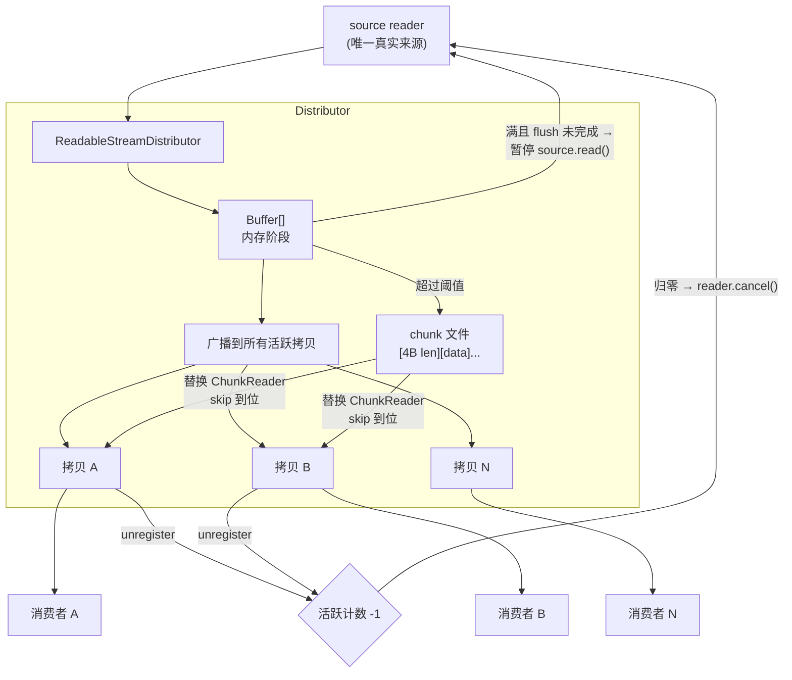
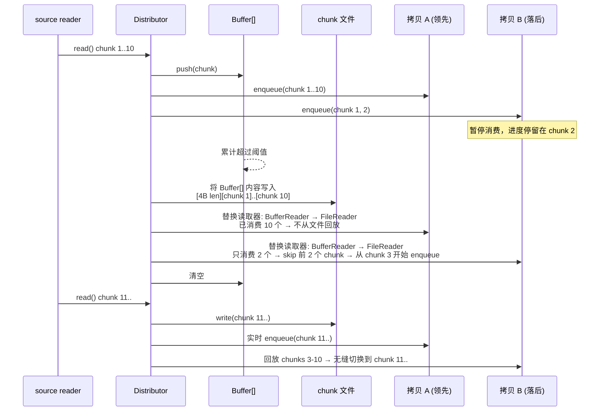
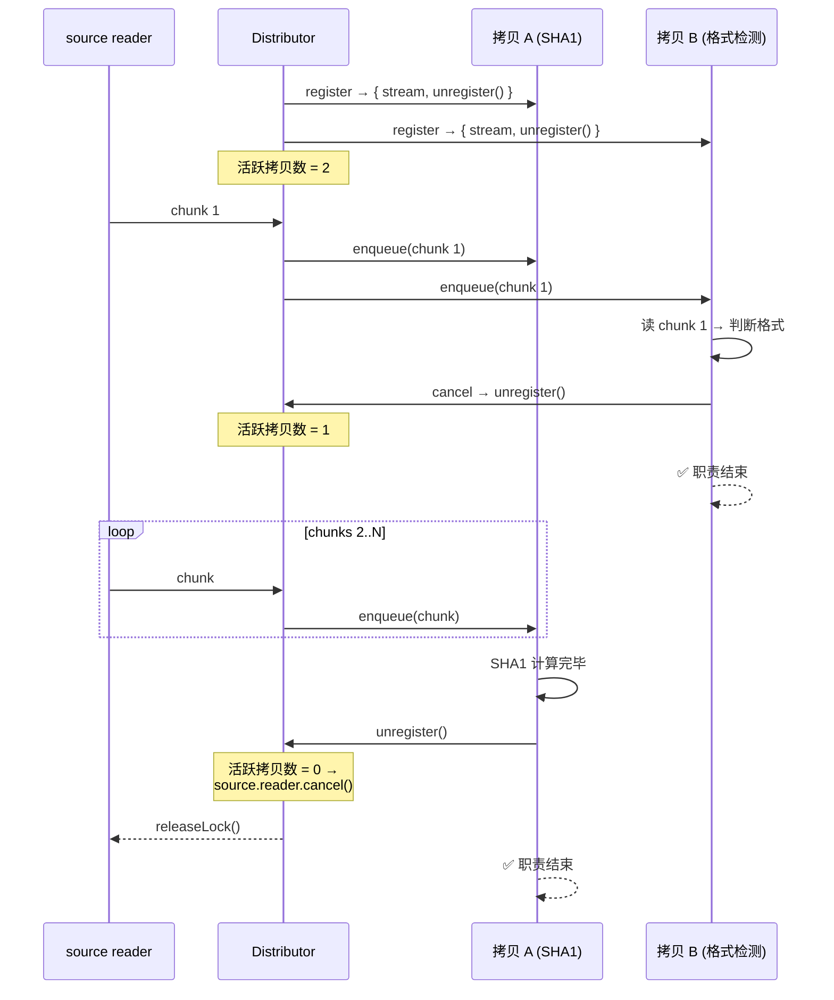

# ReadableStreamDistributor 设计文档

## 目标

将一个 `ReadableStream`（主入口流）分发给多个独立消费者。
每个消费者获得来源数据的完整、独立拷贝，消费进度互不影响。
当所有消费者停止消费时，主入口流自动释放。

支持内存缓存自动溢出到磁盘，chunk 边界保持一致。

## 核心语义

```text
主入口流（唯一真实来源）
  → register({ label }) → { stream, unregister() }
  → 每个拷贝流独立消费
  → 任一拷贝 cancel 不影响其他
  → 拷贝消费完毕（done）或 cancel 均自动清理引用
  → unregister() 仅用于主动提前终止
  → 当且仅当所有拷贝都离开
  → 主入口流 reader.cancel() / releaseLock()
```

## API

`ReadableStreamDistributor` 提供默认实现，下游按需覆盖。

- `get highWaterMark()` → `os.freemem()`
- `get tmpdir()` → `os.tmpdir()`（实时读环境变量 `TMPDIR`，
  运维可在线调整，无需重启进程）

构造条件：`source` 必须未被锁定（`source.locked === false`），
否则拒绝构造。

```js
import { ReadableStreamDistributor } from '@produck/readable-stream-distributor';

// 零覆盖：全部默认即可用
const distributor = new ReadableStreamDistributor(source);

// 或按需覆盖
class MyDistributor extends ReadableStreamDistributor {
  get highWaterMark() {
    return this.config.maxBufferSize ?? super.highWaterMark;
  }
  get tmpdir() {
    return this.config.tmpdir ?? super.tmpdir;
  }
}
const distributor = new MyDistributor(source);

// 注意：一旦溢出到磁盘后，highWaterMark 不再被查询（单向门）

const copy = distributor.register({ label: 'sha1-checker' });
// label：助记符，用于事件和统计中标识拷贝，不作唯一性约束
// → { stream: ReadableStream, unregister(): void }

// 正常消费
const reader = copy.stream.getReader();
while (true) {
  const { value, done } = await reader.read();
  if (done) break;
}

// 提前终止——不影响其他拷贝（正常消费完毕无需手动调用）
copy.unregister();

// 消费者 cancel 自己的 stream 也会自动清理引用
reader.cancel();

// 强制销毁（框架层策略执行：body 超限、请求超时、客户端断开等）
// 与错误传播同模式——延迟暴露，不对拷贝搞突袭：
// 分发器标记为已销毁 → 不再从 source 拉取新 chunk
// → 各拷贝照常消费已缓冲数据 → 耗尽后 stream error
// → error 为可辨识类型（如 AbortError），下游可据此区分
//    意外终止（source error）与策略截断（destroy）
// → 关闭文件 → 释放 source reader → 分发器不可再用
distributor.destroy();
```

## 架构



### 模块

| 模块                        | 职责                                                               |
| --------------------------- | ------------------------------------------------------------------ |
| `ReadableStreamDistributor` | 抽象类——多拷贝分发，引用计数，策略切换。`highWaterMark` 由下游实现 |
| `BufferReader`              | 内存阶段——从 `Buffer[]` 按 index 读取                              |
| `FileReader`                | 文件阶段——从 chunk 文件按游标读取                                  |
| chunk 文件格式              | `[4B len][chunk data]...` 自描述序列                               |

## 缓存文件格式

自描述 chunk 序列。内存→文件切换后，消费者看到的 chunk
边界与实时消费时完全一致。


- 写入：每 chunk `[4B BE uint32 length][body]`
- 回放：读 4B → 读 N 字节 → `enqueue` → 循环
- 回放时用 `fileHandle.read(buffer, offset, length, position)` 逐块游标前进

## 内存存储格式

内存阶段用 `Buffer[]` 数组，不与文件共用 `[4B len][chunk]` 格式。

`Buffer` 自带 `.length`，数组元素天然分隔 chunk。回放行为
与文件路径对称——两种存储格式对外吐出的 chunk 序列完全一致。

不可用单一大 `Buffer.alloc()` ——实际写入大小大概率不匹配，
小 body 时浪费巨大，大 body 时仍需溢出。

切换文件时，先将 `Buffer[]` 内容按文件格式写入，清空数组，
后续 chunk 直接走文件。

内存→磁盘是单向门：一旦切换，`highWaterMark` 后续变化不再
生效——木已成舟，不再回头。

## Chunk 读取器

每个拷贝持有独立的 `ChunkReader`。策略切换时替换读取器，
提前 skip 到位。

### 接口

```js
interface ChunkReader {
  read(): Promise<{ value: Uint8Array, done: boolean }>;
}
```

### 切换流程



## 读写协调

多拷贝 reader + 单一 writer 共享同一临时文件。
无需 `fcntl`、文件锁、OS 级协调。

三层保障：

1. **JS 单线程 + await**——`write` 之后的 `committedChunks++`
   一定在数据到达内核页缓存后执行；reader 的 `read` 在
   水位线未到前不会跨过 `await`
2. **libuv 线程池**——`write()` 阻塞直到内核接受数据
3. **OS 页缓存一致性**——不同 fd 读同一偏移量，看到
   write 完成后的数据

一个共享整数 `committedChunks` + Promise 唤醒即足够。

## 引用计数生命周期



| 事件                      | 活跃拷贝数                     |
| ------------------------- | ------------------------------ |
| 分发器启动，注册拷贝 A、B | 2                              |
| B cancel → unregister     | **1**                          |
| A 消费完毕 → unregister   | **0 → source.reader.cancel()** |

任一拷贝 cancel 不影响其他。最后一个拷贝离开时源头
才被释放。这就是"全停则全停"。

## 背压

source 按最快速率拉取。慢消费者不阻塞 source——它走 FileReader
从磁盘回放即可。

背压点只有一个：`Buffer[]` 已满且上一次磁盘 flush 尚未完成时，
暂停 `source.read()`，flush 完成后恢复。即**磁盘写入带宽决定速率**。

这不仅是性能策略，更是稳定性策略。source 通常是网络通道（如 HTTP
请求体），尽快读完意味着：

- **缩短连接生命周期**：TCP 连接更快进入 CLOSE 或复用状态，减少
  代理超时、客户端超时、负载均衡器断开的风险窗口
- **数据先行落盘**：将数据从脆弱的网络通道尽快转移到稳定存储，
  即使后续处理出错，数据仍在，可重试、可审计、可恢复
- **减少攻击面**：拖着不读的连接是敞开的资源消耗点

## 依赖

零外部依赖。仅使用：

- `node:fs`（`fs.open`、`fileHandle.read`、`fileHandle.write`）
- `node:stream/web`（`ReadableStream`）
- `node:os`（`freemem`、`tmpdir`）
- `node:path`（`join`）
- `node:crypto`（`randomBytes`——临时文件名）

## 待定

### 错误传播

source 出错后，分发器标记为错误状态，但该错误对每个拷贝**延迟暴露**——
各拷贝先正常消费自己进度之后的已缓冲 chunk，耗尽后才 `error`。新
`register()` 亦然：有已缓冲数据则先消费，耗尽后 error。

这保证每个拷贝拿到的始终是连续完整前缀（不会跳号、不会缺中间块），
且"来晚了"的拷贝也能利用已缓冲数据完成部分工作。

`destroy()` 走相同路径，但 error 类型可辨识（如 `AbortError`）：
下游不关心原因时直接忽略即可，需要区分时检查 `error.name`。
对拷贝流而言，source error 和 destroy 都是"流没走完"——异常管理
路径统一即可。

### 临时文件清理

临时文件清理策略继续搁置，实现时再定。

## 已知风险与可观测性

以下风险源于"数据与 exchange 生命周期解耦"的架构取舍，模块不替
调用方做强制策略，但提供可观测性信号：

- **悬空拷贝**：后处理拷贝出错或 hang 住时，HTTP 响应已发，无 channel
  回报状态
- **磁盘空间累积**：并发请求 × 慢拷贝消费时长 × 数据量 = 峰值磁盘
  占用
- **未 unregister 导致泄漏**：消费者既没 cancel 也没调 unregister
  且持有引用不释放时，文件描述符无法回收、磁盘文件无法删除

模块通过事件机制提供感知能力：当拷贝存活时间或落后程度超过阈值
时触发 `warn` 事件。默认策略为 `console.warn`，调用方可替换为
自定义处理器（接入日志系统、监控报警等）。这是提示而非强
制——若下游确实需要长时间后处理，忽略该事件即可。

### 纯内存模式

下游在 `get highWaterMark()` 中返回 `Number.MAX_SAFE_INTEGER`
即可事实上禁用磁盘溢出。

## 可观测性

### 生命周期事件

分发过程各节点均暴露事件，下游可零侵入接入日志与监控：

| 事件                | 含义                                   |
| ------------------- | -------------------------------------- |
| `copy:registered`   | 新拷贝上线，携带 `label`               |
| `copy:done`         | 拷贝正常消费完毕，自动清理             |
| `copy:cancelled`    | 拷贝被 cancel                          |
| `copy:unregistered` | 显式调用 unregister                    |
| `source:done`       | 源流正常结束                           |
| `source:error`      | 源流出错                               |
| `all:empty`         | 所有拷贝离开，分发器释放               |
| `destroy`           | 强制销毁，拷贝耗尽已缓冲数据后 → error |

### 统计

只读 `stats` 对象，实现成本极低：

```js
distributor.stats  // →
{
  bytesBuffered,   // 当前 Buffer[] 字节数
  bytesWritten,    // 已写入磁盘总字节数
  totalChunks,     // 已处理 chunk 数
  activeCopies,    // 当前活跃拷贝数
  peakCopies,      // 历史峰值拷贝数
}
```

## 非目标

以下不在本模块的职责范围内——这些是上层调用方的职责：

- 数据大小限制和错误码语义
- HTTP method 白名单
- "已消费"标志位管理
- 框架层响应生命周期协调
- 任何协议相关逻辑
