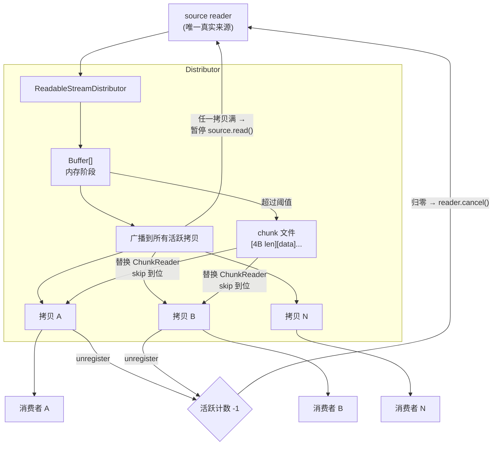
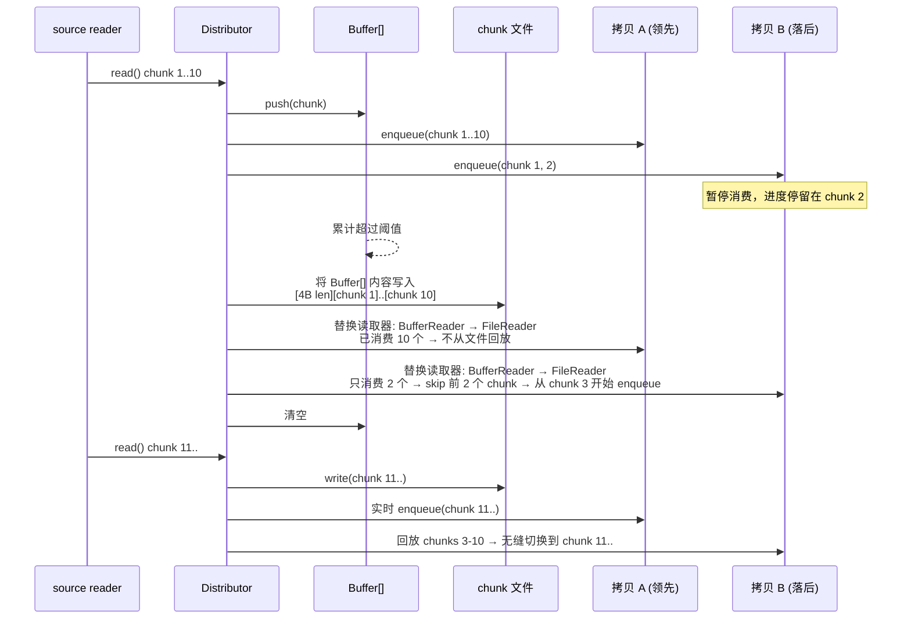
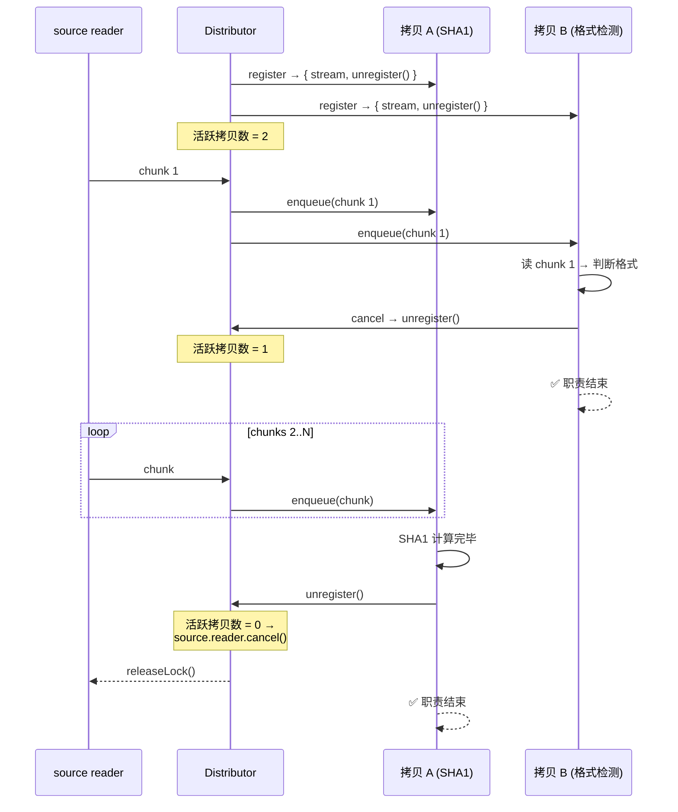

# ReadableStreamDistributor 设计文档

## 目标

将一个 `ReadableStream`（主入口流）分发给多个独立消费者。
每个消费者获得来源数据的完整、独立拷贝，消费进度互不影响。
当所有消费者停止消费时，主入口流自动释放。

支持内存缓存自动溢出到磁盘，chunk 边界保持一致。

## 核心语义

```text
主入口流（唯一真实来源）
  → register({ label }) → { stream, unregister() }
  → 每个拷贝流独立消费
  → 任一拷贝 cancel 不影响其他
  → 当且仅当所有拷贝都 unregister
  → 主入口流 reader.cancel() / releaseLock()
```

## API

```js
import { ReadableStreamDistributor } from '@produck/readable-stream-distributor';

const distributor = new ReadableStreamDistributor(source, {
  highWaterMark, // 内存 chunk 数阈值，超过后溢出到文件
  tmpdir: os.tmpdir(), // 临时文件目录
});

const copy = distributor.register({ label: 'sha1-checker' });
// → { stream: ReadableStream, unregister(): void }

// 正常消费
const reader = copy.stream.getReader();
while (true) {
  const { value, done } = await reader.read();
  if (done) break;
}

// 提前终止——不影响其他拷贝
copy.unregister();

// 消费者 cancel 自己的 stream 也会自动 unregister
reader.cancel();
```

## 架构



### 模块

| 模块                        | 职责                                  |
| --------------------------- | ------------------------------------- |
| `ReadableStreamDistributor` | 源流 → 多拷贝分发，引用计数，策略切换 |
| `BufferReader`              | 内存阶段——从 `Buffer[]` 按 index 读取 |
| `FileReader`                | 文件阶段——从 chunk 文件按游标读取     |
| chunk 文件格式              | `[4B len][chunk data]...` 自描述序列  |

## 缓存文件格式

自描述 chunk 序列。内存→文件切换后，消费者看到的 chunk
边界与实时消费时完全一致。


- 写入：每 chunk `[4B BE uint32 length][body]`
- 回放：读 4B → 读 N 字节 → `enqueue` → 循环
- 回放时用 `fileHandle.read(buffer, offset, length, position)` 逐块游标前进

## 内存存储格式

内存阶段用 `Buffer[]` 数组，不与文件共用 `[4B len][chunk]` 格式。

`Buffer` 自带 `.length`，数组元素天然分隔 chunk。回放行为
与文件路径对称——两种存储格式对外吐出的 chunk 序列完全一致。

不可用单一大 `Buffer.alloc()` ——实际写入大小大概率不匹配，
小 body 时浪费巨大，大 body 时仍需溢出。

切换文件时，先将 `Buffer[]` 内容按文件格式写入，清空数组，
后续 chunk 直接走文件。

## Chunk 读取器

每个拷贝持有独立的 `ChunkReader`。策略切换时替换读取器，
提前 skip 到位。

### 接口

```js
interface ChunkReader {
  read(): Promise<{ value: Uint8Array, done: boolean }>;
}
```

### 切换流程



## 读写协调

多拷贝 reader + 单一 writer 共享同一临时文件。
无需 `fcntl`、文件锁、OS 级协调。

三层保障：

1. **JS 单线程 + await**——`write` 之后的 `committedChunks++`
   一定在数据到达内核页缓存后执行；reader 的 `read` 在
   水位线未到前不会跨过 `await`
2. **libuv 线程池**——`write()` 阻塞直到内核接受数据
3. **OS 页缓存一致性**——不同 fd 读同一偏移量，看到
   write 完成后的数据

一个共享整数 `committedChunks` + Promise 唤醒即足够。

## 引用计数生命周期



| 事件                      | 活跃拷贝数                     |
| ------------------------- | ------------------------------ |
| 分发器启动，注册拷贝 A、B | 2                              |
| B cancel → unregister     | **1**                          |
| A 消费完毕 → unregister   | **0 → source.reader.cancel()** |

任一拷贝 cancel 不影响其他。最后一个拷贝离开时源头
才被释放。这就是"全停则全停"。

## 背压

广播前检查所有拷贝的 `controller.desiredSize`。任一 ≤ 0
则暂停 `source.read()`，等 `pull` 回调唤醒。

## 依赖

零外部依赖。仅使用：

- `node:fs`（`fs.open`、`fileHandle.read`、`fileHandle.write`）
- `node:stream/web`（`ReadableStream`）
- `node:os`（`tmpdir`）
- `node:path`（`join`）
- `node:crypto`（`randomBytes`——临时文件名）

## 非目标

以下不在本模块的职责范围内——这些是上层调用方的职责：

- 数据大小限制和错误码语义
- HTTP method 白名单
- "已消费"标志位管理
- 框架层响应生命周期协调
- 任何协议相关逻辑
