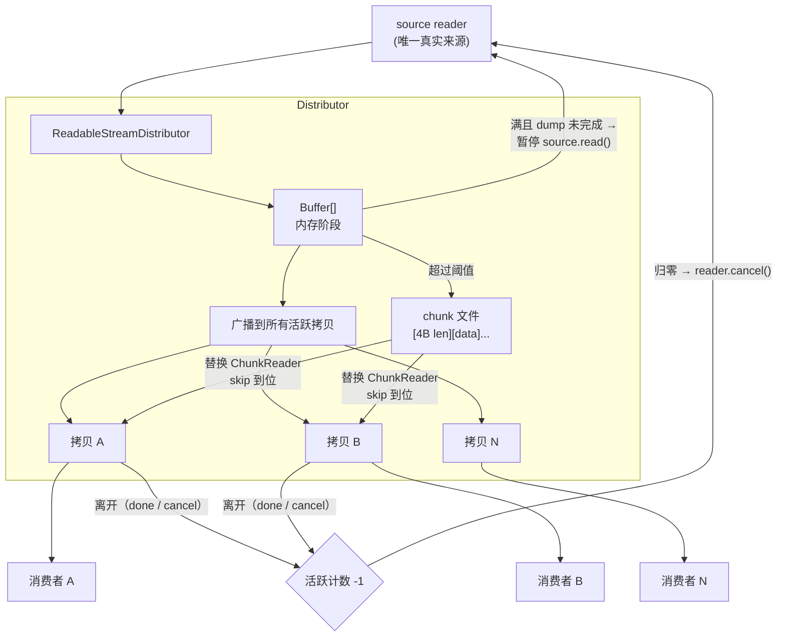
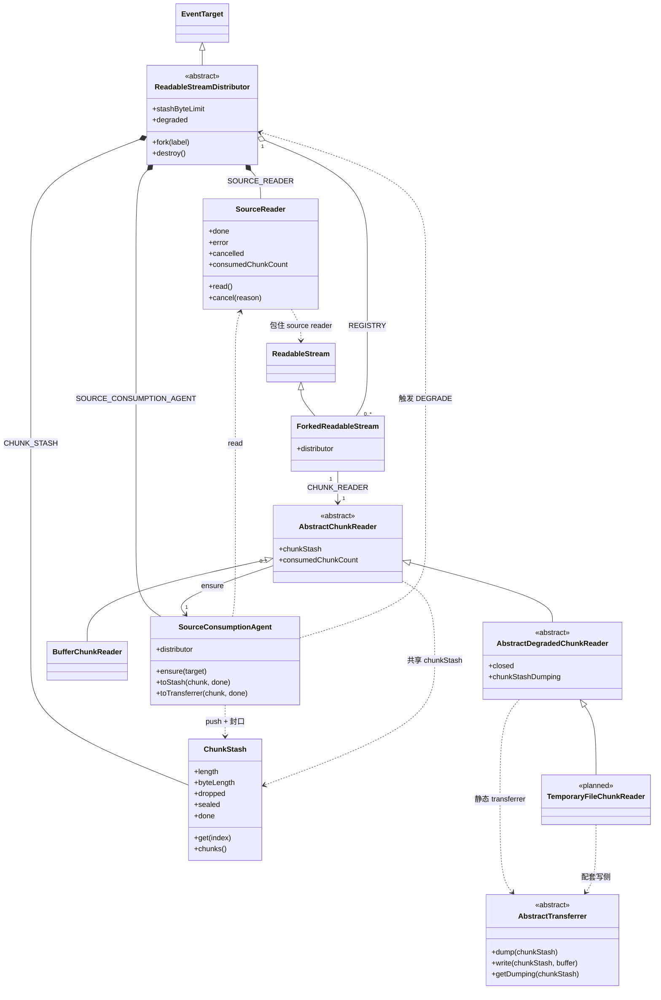
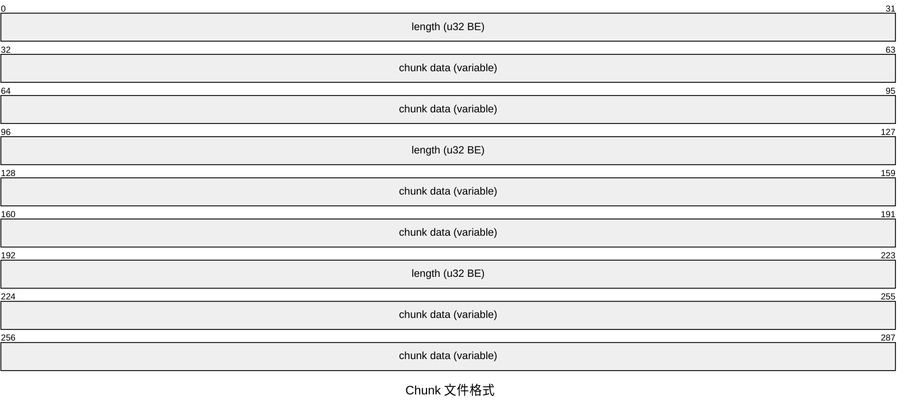
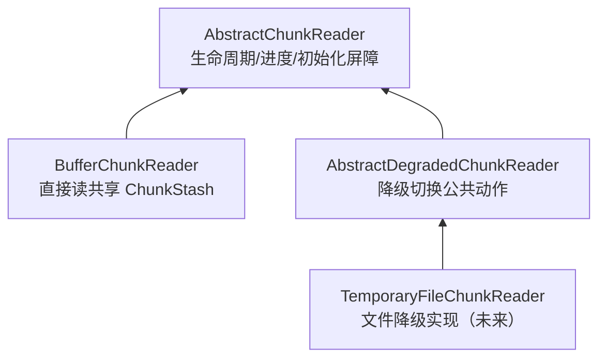
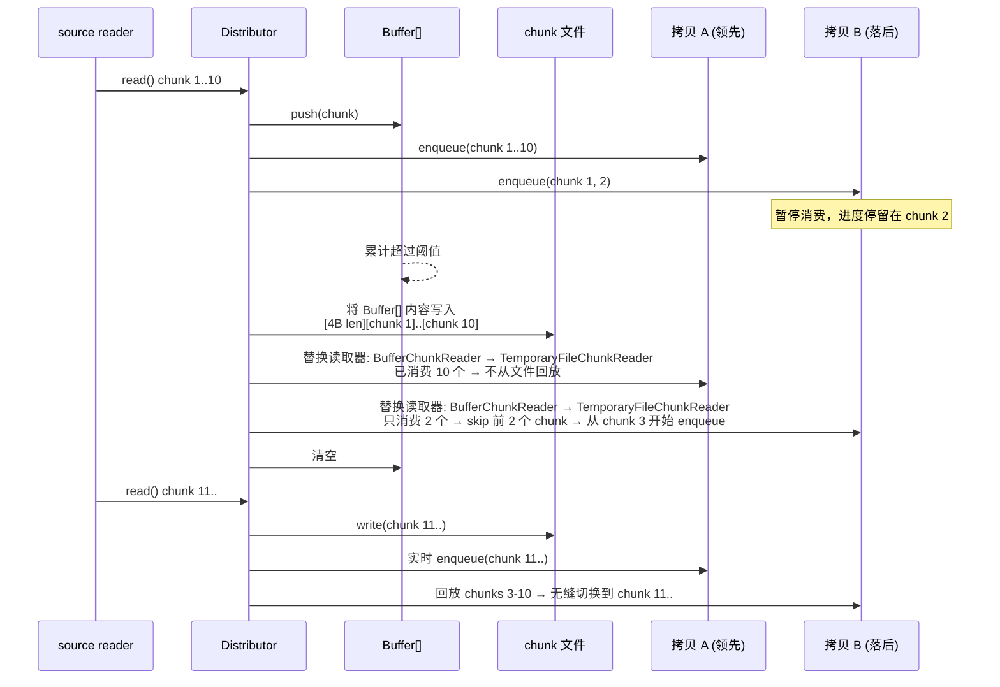
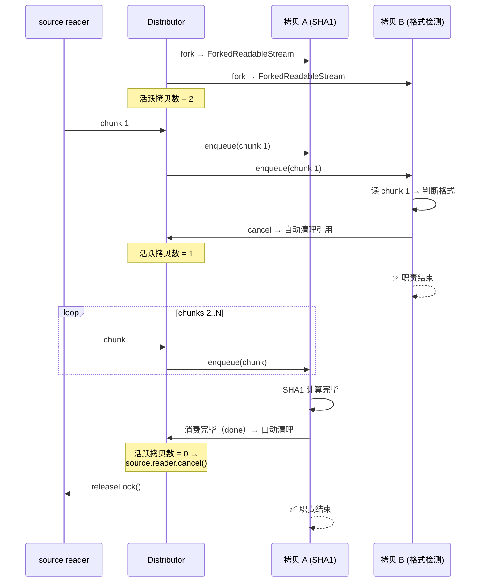

# ReadableStreamDistributor 设计文档

## 目标

`ReadableStream` 是单消费者模型——chunk 被一个消费者读走就从流中消失。
分发器打破这个限制：将一个源流分发给多个消费者，每个获得完整、独立
拷贝。消费进度互不干扰——快的不用等慢的，慢的不会丢数据。source
推进速率由全体消费者中最快的那一个自然驱动，慢者从磁盘追。

当所有消费者停止消费时，源流自动释放。

支持内存缓存自动溢出到磁盘，chunk 边界保持一致。

## 核心语义

```text
主入口流（唯一真实来源）
  → fork(label = '<UNDEFINED>') → ForkedReadableStream
  → 每个拷贝流独立消费
  → 任一拷贝 cancel 不影响其他
  → 拷贝消费完毕（done）或 cancel 均自动清理引用
  → 主动提前终止即 cancel 自己的拷贝流（无 unregister）
  → 当且仅当所有拷贝都离开
  → 主入口流 reader.cancel() / releaseLock()
```

## API

`ReadableStreamDistributor` 是**抽象类**——不能直接 `new`，下游须继承；
默认实现可按需覆盖。

- `get stashByteLimit` → 委托静态 `[_S.STASH_BYTE_LIMIT]()`，默认
  `os.freemem()`
- `get degraded` → 代理 `SourceConsumptionAgent` 的相位事实
- `[_S.DEGRADED_CHUNK_READER]` → 策略侧给出的降级读取器类，degrade 时用它
  就地构造各 fork 的新读取器

（临时文件目录等存储要素不属分发器职责，由降级策略/子类自管。）

构造条件：`source` 必须为未被锁定的 WHATWG `ReadableStream`
（`source.locked === false`），否则拒绝构造。

```js
import { ReadableStreamDistributor } from '@produck/readable-stream-distributor';

// 抽象类：须继承后实例化
class MyDistributor extends ReadableStreamDistributor {}
const distributor = new MyDistributor(source);

// 注意：一旦溢出到磁盘后，stashByteLimit 不再被查询（单向门）

const copy = distributor.fork('sha1-checker');
// label：助记符，用于事件和统计中标识拷贝，不作唯一性约束
// 省略时默认 '<UNDEFINED>'
// → ForkedReadableStream（ReadableStream 子类）；无 unregister

// 正常消费
const reader = copy.getReader();
while (true) {
  const { value, done } = await reader.read();
  if (done) break;
}

// 提前终止——cancel 自己的拷贝流，不影响其他
// （正常消费完毕会自动清理，无需手动调用）
reader.cancel();

// 强制销毁（框架层策略执行：body 超限、请求超时、客户端断开等）
// 与错误传播同模式——延迟暴露，不对拷贝搞突袭：
// 分发器标记为已销毁 → 不再从 source 拉取新 chunk
// → 各拷贝照常消费已缓冲数据 → 耗尽后 stream error
// → error 为可辨识类型（如 AbortError），下游可据此区分
//    意外终止（source error）与策略截断（destroy）
// → 关闭文件 → 释放 source reader → 分发器不可再用
distributor.destroy();
```

## 架构



### 模块

| 模块                          | 职责                                                                                                                                                   |
| ----------------------------- | ------------------------------------------------------------------------------------------------------------------------------------------------------ |
| `ReadableStreamDistributor`   | 抽象类——多拷贝分发，引用计数，策略切换。`stashByteLimit` 由下游实现                                                                                    |
| `AbstractChunkReader`         | 拷贝侧读取抽象——持有共享 `chunkStash`；进度（`consumedChunkCount`）与前沿驱动（`$I.READ` → `_I.READ`）                                                 |
| `BufferChunkReader`           | 内存阶段——直接消费共享 `ChunkStash`，按 index 读取                                                                                                     |
| `AbstractDegradedChunkReader` | 降级家族抽象——纯读；初始化屏障与 `close`；写侧经静态 `transferrer` 外置                                                                                |
| `AbstractTransferrer`         | 降级家族写侧内部抽象——介质中性的 `dump` / `write`                                                                                                      |
| `ChunkStash`                  | 共享内存缓冲容器——聚合 chunk，写/封存为受保护生命周期（push/seal/setDone/drop），读侧公开                                                              |
| `ForkedReadableStream`        | 拷贝流（内部类）——`ReadableStream` 子类；`pull` 驱动自己的 ChunkReader                                                                                 |
| `SourceReader`                | 分发器侧拉取装置——包住单流 source reader 的设备角色（读一块、闩终态、计已消费块数），不含调度                                                          |
| `SourceConsumptionAgent`      | 源流消费代理（内部类）——统筹调度（拉不拉、并发合并 single-flight、背压）与落点；按目标判定要不要碰源、拉一块、再按相位落点；与分发器 1:1，全 fork 共享 |

### 类图

当前状态下所有 `class` 声明的结构与关系。`<<abstract>>` 表示该类经
`@produck/es-abstract` 的 `Abstract()` 包装（抽象契约 + 子类校验）；
`TemporaryFileChunkReader` 尚未实现。



图注：

- `ReadableStreamDistributor` 与 `ForkedReadableStream` 分别以
  `EventTarget` / `ReadableStream` 为基类，继承自平台而非本模块。
- `ForkedReadableStream` 与 `AbstractChunkReader` 是 1:1——每个拷贝
  持有自己的读取器，进度（`consumedChunkCount`）天然 per-fork。
- `ChunkStash` 由分发器持有并注入每个 `AbstractChunkReader`（`chunkStash`），
  因此所有拷贝读取器共享同一份；`BufferChunkReader` 经继承的
  `chunkStash` 按 index 读取。它是当前唯一的 chunk 载体。
- `SourceReader` 与拷贝流无直接连线：拷贝只读自己的 ChunkReader，
  不接触 source（见「背压」）。它在构造时即锁死源，并独占其整个生命
  周期（永不 `releaseLock()`）：给分发器的源归它所有，直到分发器对象
  死亡；`stream.locked` 恒为 true 就是对外可见的所有权外观。
- `SourceConsumptionAgent` 与分发器 1:1（构造器里就建），被所有拷贝
  读取器共享：读取器只对它喊一句 `ensure`，"拉不拉、拉到哪、落到哪"全在
  它手里。它只有 `distributor` 一个引用，且不进包入口。
- `AbstractDegradedChunkReader` 的写侧不在继承链上，而以静态
  `transferrer` 外置到 `AbstractTransferrer`。

### 目录安排约定

- **内部类在对应的目录向下扩展**：非继承关系的内部实现类，在所属
  模块目录下各自建目录（向下嵌套扩展）。如 `ChunkStash/`、
  `ForkedReadableStream/` 在 `Distributor/` 下。
- **子类平行于其抽象类的类目录建立目录**：抽象类占据一个"类目录"
  （如 `ChunkReader/` = `AbstractChunkReader`）；继承它的子类，其目录
  与抽象类的类目录**平行**——同一父目录下的兄弟层级，而非在其内部
  向下扩展。子类目录内部按模块模式组织（`Abstract.mjs` / `Concrete.mjs`
  - `index.mjs` + `Symbol.mjs`）。
- **唯一特例：极端简化单文件**。无子类、无专属符号、无需独立导出
  入口的实现，可用单文件模式不建目录，平铺在与抽象类类目录平行的
  位置，文件名即类名。当前有 `BufferChunkReader`、
  `SourceConsumptionAgent` 采用
  （`Distributor/BufferChunkReader.mjs`）。

示例：

```text
Distributor/
  BufferChunkReader.mjs # AbstractChunkReader 子类（单文件特例）
  ChunkReader/          # AbstractChunkReader（抽象类类目录）
    Abstract.mjs
    index.mjs
    Symbol.mjs
  DegradedChunkReader/  # 降级家族：AbstractDegradedChunkReader（纯读抽象，与 ChunkReader/ 平行）
    Abstract.mjs
    Transferrer/        # AbstractTransferrer（家族内部抽象：写侧 dump/write）
      Abstract.mjs
      index.mjs
      Symbol.mjs
    index.mjs
    Symbol.mjs
  TemporaryFile/        # （未来）TemporaryFileChunkReader（子类，与 DegradedChunkReader/ 平行）
    Concrete.mjs
    index.mjs
    Symbol.mjs
  ChunkStash/           # 内部类（向下扩展）
  ForkedReadableStream/ # 内部类（向下扩展）
```

## 缓存文件格式

自描述 chunk 序列。内存→文件切换后，消费者看到的 chunk
边界与实时消费时完全一致。



- 写入：每 chunk `[4B BE uint32 length][body]`
- 回放：读 4B → 读 N 字节 → `enqueue` → 循环
- 回放时用 `fileHandle.read(buffer, offset, length, position)` 逐块游标前进

## 内存存储格式

内存阶段用 `Buffer[]` 数组，不与文件共用 `[4B len][chunk]` 格式。

`Buffer` 自带 `.length`，数组元素天然分隔 chunk。回放行为
与文件路径对称——两种存储格式对外吐出的 chunk 序列完全一致。

不可用单一大 `Buffer.alloc()` ——实际写入大小大概率不匹配，
小 body 时浪费巨大，大 body 时仍需溢出。

切换文件时，先将 `Buffer[]` 内容按文件格式写入，清空数组，
后续 chunk 直接走文件。

内存→磁盘是单向门：一旦切换，`stashByteLimit` 后续变化不再
生效——木已成舟，不再回头。

## Chunk 读取器

**术语**：`ChunkReader` —— 一片一片读取 chunk 的概念装置。每个拷贝
持有独立的 `ChunkReader`，策略切换时替换读取器，提前 skip 到位。

与 `source reader`（从源流拉取的 reader）区分：`ChunkReader` 是拷贝
侧的读取装置，`source reader` 是分发器侧的拉取装置，二者职责不同，
代码与文档中不共用 `READER` 一词。

### 接口

```js
interface ChunkReader {
  read(): Promise<{ value: Uint8Array, done: boolean }>;
}
```

### 消费前沿与 done

`read()` 返回的 `{ value, done }` 是读结果（IteratorResult 形状）：
`done: true` 时 `value` 必为 `undefined`——终止读天生不是一条数据。

**`done` 由叶子按"存储层自身的终结事实 + 该拷贝自己的位置"判定**：

- 内存路径：`stash.done && index >= stash.length`——`stash.done` 是内容
  终结，`index >= length` 是这一拷贝自己的 backlog 闸，两者合起来才是
  它的结束（这就是延迟暴露）。
- 文件路径：介质里的末尾标志 + 各自读到的位置，同理。
- 源已尽只在 `SourceReader` 判定一次，经**落点**交接进存储层（内存相位
  `$I.SET_DONE()`，降级相位由 transferrer 的 `setDone()`）；此后分发流只问
  存储层，不回头看源。

**"触达前沿"不再由叶子表达**：`ensure()` 的契约是"返回时目标位置已可读，
或存储层已终结"，所以叶子被调用时取不到货只可能是契约违规（实现侧按
断言处理），不是一种要往下传的状态。

驱动作用域固定在基类的受保护 `$I.READ`（每拷贝的驱动入口，包内唯一
调用者是 `ForkedReadableStream.pull`）：

- **推进**：它 `await ensure(CONSUMED_CHUNK_COUNT)` → `await _I.READ()`；叶子报非终态
  才 `CONSUMED_CHUNK_COUNT++`，再原样返回叶子的读结果。因此前进点全包只有一处，
  且只在真的交出内容时前进——它总是"下一个要取的位置"。
- **不解释 `done`**：`done` 的含义与判定都归叶子，它只借这个标志决定是否推进，
  并原样转发结果的形状。
- 降级家族**不覆写** `$I.READ`、也不走 `super`，只在 `_I.READ` 里
  `await` 初始化后转发自家 `_I.READ`；基类驱动对它们天然成立。

### 分叉架构

`ChunkReader` 家族在消费 `ChunkStash` 的方式上分叉：



- `BufferChunkReader` 直接消费共享 `ChunkStash`（按 index 读，`done`
  由 `stash.length` 决定），是内存路径分支。
- `AbstractDegradedChunkReader` 是降级读取器家族的抽象中间层，**纯读**：
  - 实例经受保护 `$I.CHUNK_STASH` 持有共享 `chunkStash`；初始化
    （`_I.INITIALIZE`）`await` 该 stash 的 **dumping 屏障**
    （`chunkStashDumping`，仅阻塞、不提供产物），`read()` / `close()`
    await 初始化完成——转存完成前绝不读。
  - **写侧不在此类**：具体 reader 通过一次性静态成员 `transferrer`
    配置一个 `AbstractTransferrer` 实例；初始化经
    `I.CONSTRUCTOR.transferrer` 取屏障。
  - 转存产物经降级策略自备的 WeakMap 传递；`id` / 文件名等是降级
    策略内部细节，非分发器职责。
  - **不设 `_I.OPEN`**：抽象初始化 `_I.INITIALIZE` 已包含 open 概念。
- `AbstractTransferrer` 是降级家族写侧的内部抽象（实例），介质中性：
  - `dump(chunkStash)` — 把整个 `ChunkStash` 转移到降级目标（不含
    封存）；抽象实例成员 `_I.DUMP` 由下游实现实际转存，
    抽象层 Promisify + 异常转义并登记 per-stash dumping Promise。
  - `write(chunkStash, buffer)` — 活数据单块续写；先 `await` 该 stash
    的 dumping 屏障再追加（返回 `undefined`）。
  - `getDumping(chunkStash)` — 查询 per-stash dumping Promise。
- `TemporaryFileChunkReader`（未来）是 `AbstractDegradedChunkReader` 的
  Node 文件系统读实现，配套其 `TemporaryFileTransferrer` 提供写侧；
  浏览器分支（IndexedDB / OPFS）同挂其下。

### 切换流程



## 读写协调

分发器不感知"落盘"——写入降级存储是**降级策略**的实现细节（呼应
BROWSER.md：分发器不 embody 文件系统概念）。分发器不维护
`committedChunks` 之类的落盘水位。

各层自我管理边界：

- **内存阶段**：`ChunkStash`（`CHUNK_STASH`）管理自身 chunk 边界
  （`length` / `byteLength`）。
- **降级阶段**：降级存储管理自身已写记录边界；降级 reader 读到自己
  存储的末尾即 `done`，无需分发器提供读水位。

写读并发（降级策略内部，如文件）无需文件锁：JS 单线程 + `await`
保证顺序，写入被内核接受后读才可见；不同 fd 读同一偏移量看到写
完成后的数据。

## 引用计数生命周期



| 事件                      | 活跃拷贝数                     |
| ------------------------- | ------------------------------ |
| 分发器启动，注册拷贝 A、B | 2                              |
| B cancel → 自动清理       | **1**                          |
| A 消费完毕 → 自动清理     | **0 → source.reader.cancel()** |

任一拷贝 cancel 不影响其他。最后一个拷贝离开时源头
才被释放。这就是"全停则全停"。

## 背压

分发器不主动拉取 source。source 的推进由拷贝的消费驱动——
拷贝的 `ensure()` 触发 `source.read()`，拿到 chunk 后广播给所有
活跃拷贝（各自 `enqueue`）。

慢拷贝不阻塞快拷贝——落后时走 TemporaryFileChunkReader 从磁盘回放即
可，不参与 source 推进节奏。source 的速率由整体消费节奏决定，不由分发器
预设。

背压点只有一个：`ChunkStash` 超过 `stashByteLimit` 且上一次 dump 尚未
完成时，暂停 `source.read()`，dump 完成后恢复。即**磁盘写入带宽决定速率**。

这与传统"木桶效应"（最慢消费者决定整体速率）不同——两级存储
（内存→磁盘）切断了快慢消费者之间的耦合。快拷贝驱动 source
推进，慢拷贝从文件追赶。磁盘是它们的缓冲带，而非瓶颈。

客观上，最快拷贝的消费节奏决定了 source 推进速率。当下游选择
快速消费时，自然获得附带收益：

- **缩短连接生命周期**：TCP 连接更快进入 CLOSE 或复用状态，减少
  代理超时、客户端超时、负载均衡器断开的风险窗口
- **数据先行落盘**：数据从脆弱的网络通道尽快转移到稳定存储，
  即使后续处理出错，仍在，可重试、可审计、可恢复
- **减少攻击面**：拖着不读的连接是敞开的资源消耗点

但分发器不替下游做这个决定——它是消费节奏的自然结果，不是
分发器的预设策略。

## 依赖

零外部依赖。仅使用：

- `node:fs`（`fs.open`、`fileHandle.read`、`fileHandle.write`）
- `node:stream/web`（`ReadableStream`）
- `node:os`（`freemem`、`tmpdir`）
- `node:path`（`join`）
- `node:crypto`（`randomBytes`——临时文件名）

## 待定

### 流终止信号

source 的终止信号（done / error / destroy）对每个拷贝**延迟暴露**——
各拷贝先正常消费自己进度之后的已缓冲 chunk，耗尽后才收到对应信号。

- **source done**：`controller.close()`，消费者的 `read()` 返回
  `{ done: true }`——正常结束
- **source error**：`controller.error(err)`，消费者的 `read()` reject
  ——意外终止
- **destroy**：同 error 路径，但错误类型可辨识（如 `AbortError`），
  下游可据此区分意外终止与策略截断

这保证每个拷贝拿到的始终是连续完整前缀（不会跳号、不会缺中间块），
且"来晚了"的拷贝也能利用已缓冲数据完成部分工作。新 `fork()`
亦然。

对拷贝流而言，三种终止都是"流结束了"——下游不关心原因时统一处理，
需要区分时检查 `error.name`。

### 临时文件清理

临时文件清理策略继续搁置，实现时再定。

## 已知风险与可观测性

以下风险源于"数据与 exchange 生命周期解耦"的架构取舍，模块不替
调用方做强制策略，但提供可观测性信号：

- **悬空拷贝**：后处理拷贝出错或 hang 住时，HTTP 响应已发，无 channel
  回报状态
- **磁盘空间累积**：并发请求 × 慢拷贝消费时长 × 数据量 = 峰值磁盘
  占用
- **未释放导致泄漏**：消费者既没 cancel 自己的拷贝流、也不释放引用时，
  文件描述符无法回收、磁盘文件无法删除

模块通过事件机制提供感知能力：当拷贝存活时间或落后程度超过阈值
时触发 `warn` 事件。默认策略为 `console.warn`，调用方可替换为
自定义处理器（接入日志系统、监控报警等）。这是提示而非强
制——若下游确实需要长时间后处理，忽略该事件即可。

### 纯内存模式

下游在 `get stashByteLimit()` 中返回 `Number.MAX_SAFE_INTEGER`
即可事实上禁用磁盘溢出。

## 可观测性

分发器不维护统一的状态快照，也不暴露 `stats` 之类的聚合对象：可观察
信号按数据归属分散在组件与受保护成员上。

- 内存缓冲当前字节 / 块数：`CHUNK_STASH`（ChunkStash）的
  `byteLength` / `length`，由缓冲容器自管。
- 是否进入降级：`distributor.degraded`（代理消费代理的相位事实）。
- 源侧终局：`SOURCE_READER`（SourceReader）的 `done` / `error` /
  `cancelled`——源到头 / 源出错 / 我们收摊，三个终局互斥穷尽。
- 当前活跃 fork 集合：`$I.REGISTRY`（活跃数即 `size`）。
- 落盘 / 存储侧水位：降级 reader 与存储策略自管，分发器不感知。

### 生命周期事件

分发器是 `EventTarget`，当前已派发：

| 事件      | 含义           |
| --------- | -------------- |
| `fork`    | 新 fork 上线   |
| `destroy` | 强制销毁被调用 |

源流结束 / 出错、全部 fork 离开等更细粒度事件尚未实现，属规划。

## 非目标

以下不在本模块的职责范围内——这些是上层调用方的职责：

- 数据大小限制和错误码语义
- HTTP method 白名单
- "已消费"标志位管理
- 框架层响应生命周期协调
- 任何协议相关逻辑
