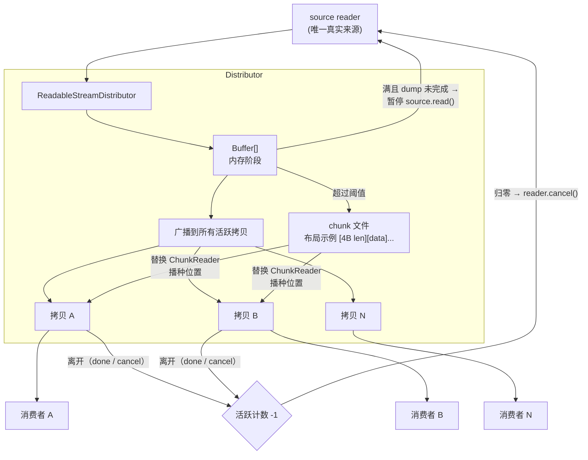
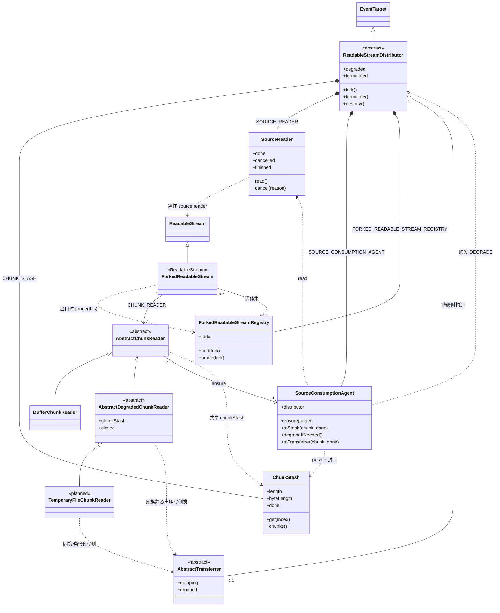
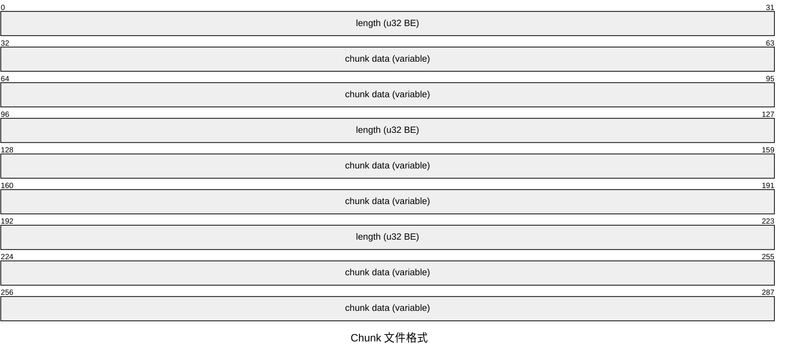
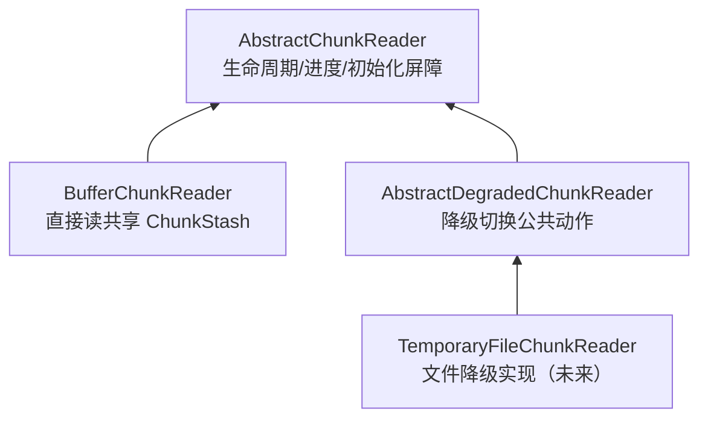
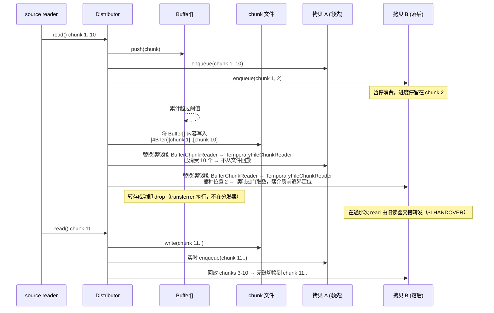
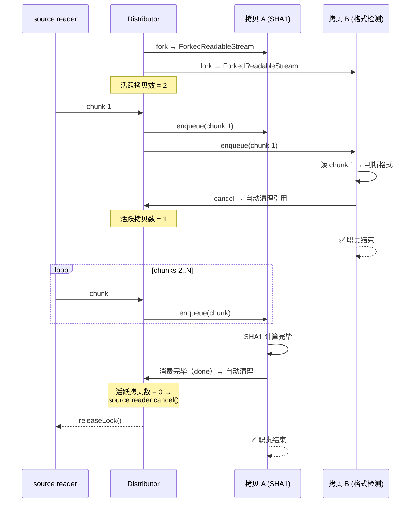

# ReadableStreamDistributor 设计文档

## 目标

`ReadableStream` 是单消费者模型——chunk 被一个消费者读走就从流中消失。
分发器打破这个限制：将一个源流分发给多个消费者，每个获得完整、独立
拷贝。消费进度互不干扰——快的不用等慢的，慢的不会丢数据。source
推进速率由全体消费者中最快的那一个自然驱动，慢者从磁盘追。

当所有消费者停止消费时，源流自动释放。

支持内存缓存自动溢出到磁盘，chunk 边界保持一致。

## 核心语义

```text
主入口流（唯一真实来源）
  → fork() → ForkedReadableStream
  → 每个拷贝流独立消费
  → 任一拷贝 cancel 不影响其他
  → 拷贝消费完毕（done）或 cancel 均自动清理引用
  → 主动提前终止即 cancel 自己的拷贝流（无 unregister）
  → 当且仅当所有拷贝都离开
  → 主入口流 reader.cancel() / releaseLock()
```

## API

`ReadableStreamDistributor` 是**抽象类**——不能直接 `new`，下游须继承；
默认实现可按需覆盖。

- 内存→介质阈值：选项 `MaxStashByteLength`（默认 `1GiB`），读经
  `Options.Get`、写经 `Options.Tune`（构造器只收 `source`）
- `get degraded` → 观察 `$I.TRANSFERRER`（相位只有一个事实来源）
- `[_S.DEGRADED_CHUNK_READER_CTOR]` → 策略侧给出的降级读取器类，degrade
  时用它就地构造各 fork 的新读取器
- 新 `fork()` 的读器取自当前相位字段 `I.CURRENT_CHUNK_READER_CTOR`（初值
  内存类，降级换读器时翻成上面那个策略类）

（临时文件目录等存储要素不属分发器职责，由降级策略/子类自管。）

构造条件：`source` 必须为**本 realm** 的、未被锁定的 WHATWG
`ReadableStream`（`source instanceof ReadableStream` 且 `source.locked ===
false`），否则拒绝构造。跨 realm（iframe / worker / 另一 `vm` 上下文）的流
不直接接受：先经适配层转成本地 `ReadableStream` 再传入。

```js
import { ReadableStreamDistributor } from '@produck/readable-stream-distributor';

// 抽象类：须继承后实例化
class MyDistributor extends ReadableStreamDistributor {}
const distributor = new MyDistributor(source);

// 注意：阈值经 `Options.Tune.MaxStashByteLength` 设定（默认 `1GiB`），
// 一旦溢出到磁盘后 `MaxStashByteLength` 不再被查询（单向门）

const copy = distributor.fork();
// → ForkedReadableStream（ReadableStream 子类）；无 unregister

// 正常消费
const reader = copy.getReader();
while (true) {
  const { value, done } = await reader.read();
  if (done) break;
}

// 提前终止——cancel 自己的拷贝流，不影响其他
// （正常消费完毕会自动清理，无需手动调用）
reader.cancel();

// 关闸门（框架层策略执行：body 超限、请求超时、客户端断开等）
// → 不再接受新 fork（再 fork() 抛错）；已建拷贝照旧运行
// → 需要数据就继续向源拉取，直到源自己到头（read() 收 {done: true}）
// 切断源 + 封口（前沿定长）+ 当场结束所有拷贝：
//    每个活体立刻 error(AbortError)，不补已缓冲的前缀
// → terminate 对读侧不可见，destroy 当场可辨（下游看 error.name）
// → destroy 返回收摊 Promise（幂等）：源取消 + 在途 pull 落定后
//    释放内存相 stash；降级相由 transferrer 关介质，见「引用计数生命周期」
distributor.terminate();
distributor.destroy();
```

## 架构



### 模块

| 模块                           | 职责                                                                                                                                                                 |
| ------------------------------ | -------------------------------------------------------------------------------------------------------------------------------------------------------------------- |
| `ReadableStreamDistributor`    | 抽象类——多拷贝分发，引用计数，策略切换。阈值是构造参数（默认 `1GiB`），落受保护字段                                                                                  |
| `AbstractChunkReader`          | 拷贝侧读取抽象——受保护 `I.DISTRIBUTOR` 持分发器（`agent` / `stash` 按需取）；进度与前沿驱动（`$I.ENSURE_THEN_READ` → `$I.READ` → `_I.READ`）                         |
| `BufferChunkReader`            | 内存阶段——直接消费共享 `ChunkStash`，按 index 读取                                                                                                                   |
| `AbstractDegradedChunkReader`  | 降级家族抽象——纯读；初始化屏障与 `close`；写侧类由 `_S.TRANSFERRER_CTOR`（家族）声明，实例由分发器降级时构造并交接                                                   |
| `AbstractTransferrer`          | 降级家族写侧内部抽象——介质中性的受保护 `$I.DUMP` / `$I.WRITE` / `$I.SET_DONE` / `$I.DROP` + `$I.SET_DISTRIBUTOR`（构造后挂上自己，失败就地报），读侧位置门与队列计数 |
| `ChunkStash`                   | 共享内存缓冲容器——聚合 chunk，写面为受保护生命周期（push/setDone/drop），读侧公开                                                                                    |
| `ForkedReadableStream`         | 拷贝流（内部类）——`ReadableStream` 子类；`pull` 驱动自己的 ChunkReader                                                                                               |
| `SourceReader`                 | 分发器侧拉取装置——包住单流 source reader 的设备角色（读一块、闩终态、源侧失败在此派发），不含调度                                                                    |
| `SourceConsumptionAgent`       | 源流消费代理（内部类）——统筹调度（拉不拉、并发合并 single-flight、背压）与落点；按目标判定要不要碰源、拉一块、再按相位落点；与分发器 1:1，全 fork 共享               |
| `ForkedReadableStreamRegistry` | fork 活体注册表（内部协作类）——`add(fork)` 入册、可遍历供降级换读器、fork 出口 `prune(fork)` 出表（成员资格 = 降级交接名单，无扫描清理）                             |

### 类图

当前状态下所有 `class` 声明的结构与关系。`<<abstract>>` 表示该类经
`@produck/es-abstract` 的 `Abstract()` 包装（抽象契约 + 子类校验）；
`TemporaryFileChunkReader` 尚未实现。



图注：

- `ReadableStreamDistributor` 与 `ForkedReadableStream` 分别以
  `EventTarget` / `ReadableStream` 为基类，继承自平台而非本模块。
- `ForkedReadableStream` 与 `AbstractChunkReader` 是 1:1——每个拷贝
  持有自己的读取器，进度（受保护 `$I.CONSUMED_CHUNK_COUNT`）天然 per-fork。
- `ChunkStash` 由分发器持有，读取器各自按需从分发器取（受保护
  `I.DISTRIBUTOR`），因此所有拷贝读取器共享同一份；`BufferChunkReader`
  也经它按 index 读取。它是当前唯一的 chunk 载体。
- `SourceReader` 与拷贝流无直接连线：拷贝只读自己的 ChunkReader，
  不接触 source（见「背压」）。它在构造时即锁死源，并独占其整个生命
  周期（永不 `releaseLock()`）：给分发器的源归它所有，直到分发器对象
  死亡；`stream.locked` 恒为 true 就是对外可见的所有权外观。它也只持
  `distributor` 一个引用（唯一用途：在发生处派收摊失败）。
- `SourceConsumptionAgent` 与分发器 1:1（构造器里就建），被所有拷贝
  读取器共享：读取器只对它喊一句 `ensure`，"拉不拉、拉到哪、落到哪"全在
  它手里。它只有 `distributor` 一个引用，且不进包入口。
- `AbstractDegradedChunkReader` 的写侧不在继承链上：家族静态声明写侧类
  （`_S.TRANSFERRER_CTOR`），分发器降级时用它构造实例并持有，
  再交接给各拷贝的新读取器。

### 目录安排约定

- **内部类在对应的目录向下扩展**：非继承关系的内部实现类，在所属
  模块目录下各自建目录（向下嵌套扩展）。如 `ChunkStash/`、
  `ForkedReadableStream/` 在 `Distributor/` 下。
- **子类平行于其抽象类的类目录建立目录**：抽象类占据一个"类目录"
  （如 `ChunkReader/` = `AbstractChunkReader`）；继承它的子类，其目录
  与抽象类的类目录**平行**——同一父目录下的兄弟层级，而非在其内部
  向下扩展。子类目录内部按模块模式组织（`Abstract.mjs` / `Concrete.mjs`
  - `index.mjs` + `_Symbol.mjs` + `_External.mjs`）；
- **唯一特例：极端简化单文件**。无子类、无专属符号、无需独立导出
  入口的实现，可用单文件模式不建目录，平铺在与抽象类类目录平行的
  位置，文件名即类名。当前只有 `SourceConsumptionAgent` 采用
  （`Distributor/SourceConsumptionAgent.mjs`）；`BufferChunkReader`
  有两个专属符号（`I.SUCCESSOR` / `$I.HANDOVER`）与自己的桥，所以
  是目录。

示例：

```text
Distributor/
  BufferChunkReader/    # AbstractChunkReader 子类（内存路径；有专属符号与桥）
    Concrete.mjs
    index.mjs
    _Symbol.mjs
    _External.mjs
  ChunkReader/          # AbstractChunkReader（抽象类类目录）
    Abstract.mjs
    index.mjs
    Parser.mjs
    _Symbol.mjs
    _External.mjs
  DegradedChunkReader/  # 降级家族：AbstractDegradedChunkReader（纯读抽象，与 ChunkReader/ 平行）
    Abstract.mjs
    Transferrer/        # AbstractTransferrer（家族内部抽象：写侧 dump/write）
      Abstract.mjs
      index.mjs
      _Symbol.mjs
      _External.mjs
    index.mjs
    _Symbol.mjs
    _External.mjs
  TemporaryFile/        # （未来）TemporaryFileChunkReader（子类，与 DegradedChunkReader/ 平行）
    Concrete.mjs
    index.mjs
    _Symbol.mjs
  ChunkStash/           # 内部类（向下扩展）
  ForkedReadableStream/ # 内部类（向下扩展）
  SourceConsumptionAgent.mjs # 单文件特例：无子类、无专属符号、无独立导出
```

## 缓存文件格式

自描述 chunk 序列。内存→文件切换后，消费者看到的 chunk
边界与实时消费时完全一致。



- 写入：每 chunk `[4B BE uint32 length][body]`
- 回放：读 4B → 读 N 字节 → `enqueue` → 循环
- 回放时用 `fileHandle.read(buffer, offset, length, position)` 逐块游标前进

## 内存存储格式

内存阶段用 `Buffer[]` 数组，不与文件共用 `[4B len][chunk]` 格式。

`Buffer` 自带 `.length`，数组元素天然分隔 chunk。回放行为
与文件路径对称——两种存储格式对外吐出的 chunk 序列完全一致。

不可用单一大 `Buffer.alloc()` ——实际写入大小大概率不匹配，
小 body 时浪费巨大，大 body 时仍需溢出。

切换文件时，先将 `Buffer[]` 内容按文件格式写入，清空数组，
后续 chunk 直接走文件。

内存→磁盘是单向门：一旦切换就不再回头——阈值也在构造时定死，
不存在后续变化。默认 `1GiB` 取"多数情况不降级"的主流行为：代价是
慢消费者下最多驻留这么多内存，小内存宿主应显式调小。

## Chunk 读取器

**术语**：`ChunkReader` —— 一片一片读取 chunk 的概念装置。每个拷贝
持有独立的 `ChunkReader`，策略切换时替换读取器并播种位置（定位
由驱动器在读时逐界引导）；
切换之后新建的拷贝取当前相位字段，故也是降级读器。

与 `source reader`（从源流拉取的 reader）区分：`ChunkReader` 是拷贝
侧的读取装置，`source reader` 是分发器侧的拉取装置，二者职责不同，
代码与文档中不共用 `READER` 一词。

### 接口

```js
interface ChunkReader {
  read(): Promise<{ value: Uint8Array, done: boolean }>;
}
```

### 消费前沿与 done

`read()` 返回的 `{ value, done }` 是读结果（IteratorResult 形状）：
`done: true` 时 `value` 必为 `undefined`——终止读天生不是一条数据。

**`done` 由介质侧按"存储层自身的终结事实 + 该拷贝自己的位置"判定**：

- 内存路径：`stash.done && index >= stash.length`——`stash.done` 是内容
  终结，`index >= length` 是这一拷贝自己的 backlog 闸，两者合起来才是
  它的结束。
- 文件路径：介质里的末尾标志 + 各自读到的位置，同理。
- 源已尽只在 `SourceReader` 判定一次，经**落点**交接进存储层（内存相位
  `$I.SET_DONE()`，降级相位由 transferrer 的 `setDone()`）；此后分发流只问
  存储层，不回头看源。

**"触达前沿"不再由介质侧表达**：`ensure()` 的契约是"返回时目标位置已可读，
或存储层已终结"，所以介质侧被调用时取不到货只可能是契约违规（实现侧按
断言处理），不是一种要往下传的状态。

驱动作用域固定在基类的受保护 `$I.ENSURE_THEN_READ`（每拷贝的驱动入口，
包内唯一调用者是 `ForkedReadableStream.pull`）：

- **入口**：`$I.ENSURE_THEN_READ` = `await ensure(CONSUMED_CHUNK_COUNT)` +
  `$I.READ`。内存族把在途那笔转发给接替者时只走 `$I.READ`——这一笔的
  ensure 已由转发者做过，不必再向代理问一遍。
- **取一笔**：`$I.READ` = `await _I.READ()` → 介质侧报非终态才
  `CONSUMED_CHUNK_COUNT++` → 原样返回读结果；不含 ensure。因此前进点全包
  只有一处，
  且只在真的交出内容时前进——它总是"下一个要取的位置"。
- **不解释 `done`**：`done` 的含义与判定都归介质侧，它只借这个标志决定是否推进，
  并原样转发结果的形状。
- **形状归声明，由 es-abstract 管**：非终态必带块——`_I.READ` 的返回描述是
  `ChunkReader/Parser.ReadableStreamResult`（两家族都挂）；生产构建经
  `@produck/es-abstract-token/erase` 擦掉规格描述，所以只在 dev/test 校验。
  理由见 DEV「读路径」。
- 降级家族**不覆写** `$I.READ`、也不走 `super`，只在 `_I.READ` 里
  `await` 初始化后转发自家 `_I.READ`；基类驱动对它们天然成立。

### 分叉架构

`ChunkReader` 家族在消费 `ChunkStash` 的方式上分叉：



- `BufferChunkReader` 直接消费共享 `ChunkStash`（按 index 读，`done`
  由 `stash.length` 决定），是内存路径分支。
- `AbstractDegradedChunkReader` 是降级读取器家族的抽象中间层，**纯读**：
  - 实例只持分发器（受保护 `I.DISTRIBUTOR`）；共享 `chunkStash` 与写侧
    `transferrer` 由 `get chunkStash` / `get transferrer` 按需取出，
    `get closed` 暴露状态；读侧**不认识
    dump**，只认**接受度** `transferrer.$I.WAIT_POSITION(position)`：每次
    `read()` 先过门，队列里还在的位由抽象层直接交付；要走介质时先惰性
    初始化——策略要 open / 定位时介质必已存在；`close()` await 它。
  - **写侧不在此类**：写侧类由家族静态 `_S.TRANSFERRER_CTOR`
    声明；分发器在降级时用它构造实例并持有，交接给本读取器。构造
    参数由策略经 `setTransferrerArgs()` 预置（家族的 `_S.PARSE_ARGUMENTS`
    归一，基类默认恒等），分发器不解释。
  - 转存产物（文件名/偏移等）可留在 Transferrer 实例自己的字段里——
    实例与 `ChunkStash` 1:1；`id` / 文件名等是降级策略内部细节，非
    分发器职责。
  - **不设 `_I.OPEN`**：抽象初始化 `_I.INITIALIZE` 已包含 open 概念。
- `AbstractTransferrer` 是降级家族写侧的内部抽象（实例），介质中性；
  实例由分发器在降级时构造、挂上自己（`$I.SET_DISTRIBUTOR`）并持有（类取自
  读器家族的 `_S.TRANSFERRER_CTOR`），与 `ChunkStash` 1:1；构造参数由策略
  经 `setTransferrerArgs()` 预置（`_S.PARSE_ARGUMENTS` 归一、默认恒等），
  不解释：
  - **无阻塞调度的复杂性全在此作用域**：降级时**接管** stash 的整份
    块列表（同一批对象，只加引用），活块续在队尾——一条 FIFO
    （`I.DRAIN` 单飞）就是全部；外部（分发器与读器）既不 `await` dump，
    也不判断换读器时机。
  - `$I.DUMP(chunkStash)` — 交出整个 `ChunkStash`，**同步
    返回**：先接管 stash 的整份块列表（此刻队列必空），再把那一趟记进
    `I.DUMPING` 并返回，本体在 `I.START_DUMPING` 里——同一步里就调抽象
    `_I.DUMP` 开工，成功即 `DROP` 载体、清掉接管的这 L 条（已落盘）并把
    水位一次推满；失败只闩 `I.ERROR` 并结算门（保留现场不 DROP；接管的
    这批仍在队列里，各拷贝按自己位置读到底，只有永不会有块的位被拒），
    返回的 Promise 以转义错误拒（`dump-failed` 已在发生处派出）。
  - `$I.WRITE(buffer)` — 活数据**入队即返回**（不碰介质）：追加待写
    队列并确保 drain 在途；队列无上限，积压处置归下游。
  - `$I.SET_DONE()` — 源已尽在降级相位的落点：agent 在 done 那趟拉取
    同步置位；同时结算门（"该位永不会有块"由它冻结）。
  - 读侧原语：`$I.WAIT_POSITION(position)`（等该位**已被接受**：在介质上
    或在队列里；到头也算。介质失败只否决未被接受的位，已被接受的位
    照发）与 `$I.PEEK(position)`（取队列里那一块，
    越界/已落介质则 `undefined`）。实例是纯内部对象：不开公开观察面
    （调试看符号表），家族只经 `get dumping` 与 `$I` 原语交互。
  - 状态就是实例字段——1:1 之下无需再按 stash 键控。
- `TemporaryFileChunkReader`（未来）是 `AbstractDegradedChunkReader` 的
  Node 文件系统读实现，配套其 `TemporaryFileTransferrer` 提供写侧；
  浏览器分支（IndexedDB / OPFS）同挂其下。

### 切换流程



**边界策略是一个选项**（`DegradeOnStashFullAndDone`）：阈值判据
（`degradeIfNeeded()`）在 `pull()` 里跑、**对 `done` 那一趟也跑**，
“达到上限且源已到头”时切不切由该选项决定——**默认不切**（数据全集已在
stash 里且不会再涨，落介质只是白搬一趟），取“切”时切换的执行必须自己把
状态交代清楚，第一条就是
**终态随交接走**：stash 已 `done` 就先给新落点 `$I.SET_DONE()`，否则读器会在
前沿等一个永不来的下一笔（旧写法把判据塞在 `toStash` 末尾、只对 `PUSH` 跑，
所以“不切换”只是碰巧，不是策略）。失败也不锁死：判据每趟都跑，宿主修好之后
下一趟就重新尝试。

## 读写协调

分发器不感知"落盘"——写入降级存储是**降级策略**的实现细节（呼应
BROWSER.md：分发器不 embody 文件系统概念）。分发器不维护
`committedChunks` 之类的落盘水位：水位由 transferrer 自持
（`writtenChunkCount`），读侧经位置门取用，不回流到分发器。

各层自我管理边界：

- **内存阶段**：`ChunkStash`（`CHUNK_STASH`）管理自身 chunk 边界
  （`length` / `byteLength`）。
- **降级阶段**：降级存储管理自身已写记录边界；降级 reader 读到自己
  存储的末尾即 `done`，无需分发器提供读水位。

写读并发（降级策略内部，如文件）无需文件锁：JS 单线程 + `await`
保证顺序，写入被内核接受后读才可见；不同 fd 读同一偏移量看到写
完成后的数据。

## 引用计数生命周期



| 事件                      | 活跃拷贝数                     |
| ------------------------- | ------------------------------ |
| 分发器启动，注册拷贝 A、B | 2                              |
| B cancel → 自动清理       | **1**                          |
| A 消费完毕 → 自动清理     | **0 → source.reader.cancel()** |

任一拷贝 cancel 不影响其他。最后一个拷贝离开时源头
才被释放。这就是"全停则全停"。

**已实现（内存相）**：`destroy()` 已经把每个拷贝当场结束并让它出表，
所以释放不再需要引用计数：它在源取消与在途 pull 落定之后
`$I.DROP()` 内存相 stash——这就是「收摊」。调用当场完成的只有“结束
所有拷贝”，封口与释放都随返回的 Promise 落地。

**已实现**：两侧同一个动词——`$I.DROP()`（放开载体），都只由
`destroy()` 触发：内存相放开 stash 里的块，降级相放开待写队列并放开介质。
至于“没人要了就自动放开”，已明确**不做**：没有活跃 fork、但没
`terminate()` 的分发器仍能 fork（只是进度落后），所以何时完全放开是
宿主的决定，不是框架从“没人在看”推出来的。

**读器关闭**：`$I.CLOSE` 的键归基类（内存族空实现），降级族覆盖它。
调用时机是“这个拷贝不再读了”：流正常读完、读抛出、拷贝自己取消，以及
`destroy()` 收摊。前三条会 `prune`，故收摊通常扫不到它们；但 `destroy()`
当场若有一笔读在飞，它随后以失败落定仍会再走一次收尾——幂等由
`I.CLOSED` 兜住，不靠互斥。它只放开读器自己的资源：介质是各读器共享的，归
`$I.DROP()` 与 transferrer，它不碰。
`terminate()` 则什么也不释放（它只关闸门）。

## 背压

分发器不主动拉取 source。source 的推进由拷贝的消费驱动——
拷贝的 `ensure()` 触发 `source.read()`，拿到 chunk 后广播给所有
活跃拷贝（各自 `enqueue`）。

慢拷贝不阻塞快拷贝——落后时走 TemporaryFileChunkReader 从磁盘回放即
可，不参与 source 推进节奏。source 的速率由整体消费节奏决定，不由分发器
预设。

背压点：降级后不再有"等 dump 完成"这一档。`$I.WRITE` 入队即返回、
`$I.DUMP` 同步返回，pull 的落点不再阻塞；落点从"内存 stash"变为
"transferrer 的 FIFO 管道"（唯一写入者 = 单飞 drain）。于是背压量纲
变成**队列占用**——抽象层不设上限、不做闸门，也不外露观察面
（调试看符号），积压怎么处置是下游的实现问题。

读侧只等**自己的位被接受**（在介质上或在队列里）：队列本身就是内存
缓冲，所以 dump 在途期间照样能读（实测首读 1ms，整条 20 块的流只碰
介质 1 次）。剩下的等待只有"位还没拉进来"，与介质进度无关；介质的
进度只决定"从哪儿取"。`ensure()` 的 join 收窄为只在"源已闩、落点未
落地"时等待（2026-09-15）。见
`SWITCHING.md` §6。

这与传统"木桶效应"（最慢消费者决定整体速率）不同——两级存储
（内存→磁盘）切断了快慢消费者之间的耦合。快拷贝驱动 source
推进，慢拷贝从文件追赶。磁盘是它们的缓冲带，而非瓶颈。

客观上，最快拷贝的消费节奏决定了 source 推进速率。当下游选择
快速消费时，自然获得附带收益：

- **缩短连接生命周期**：TCP 连接更快进入 CLOSE 或复用状态，减少
  代理超时、客户端超时、负载均衡器断开的风险窗口
- **数据先行落盘**：数据从脆弱的网络通道尽快转移到稳定存储，
  即使后续处理出错，仍在，可重试、可审计、可恢复
- **减少攻击面**：拖着不读的连接是敞开的资源消耗点

但分发器不替下游做这个决定——它是消费节奏的自然结果，不是
分发器的预设策略。

## 依赖

零外部依赖，且当前源码**零 `node:` 导入**——只用平台全局：

- `EventTarget` / `ReadableStream`（WHATWG，Node 与浏览器都有）
- `DOMException`（`destroy()` 取消源时的原因，`name` 可辨识）
- `Set` / `Map` / `Promise.withResolvers`（语言内建）

将来实现真正的文件降级时才会用到 `node:fs`（打开/读写）与 `node:crypto`
（临时文件名的随机段），且都应落在 Node 专属模块里，不进平台中立的基类。

## 终止信号

四种收场对每个拷贝的观感：

- **source done**：`controller.close()`，消费者的 `read()` 返回
  `{ done: true }`——正常结束
- **source error**：`controller.error(err)`，消费者的 `read()` reject
  ——意外终止
- **`terminate()`**：拷贝**感觉不到**。它只关闸门（不再接受新 fork），
  已建拷贝照旧运行——需要数据就继续向源拉取
- **`destroy()`**：闸门 + 封口（前沿定长）+ 切断源 + **关掉每个拷贝的
  读器并当场结束它**。每个活体立刻收到 `error(终止原因)`——可辨识的
  `AbortError`，**不补**已缓冲的前缀（分级：`terminate` 对读侧不可见，
  `destroy` 当场可辨）。当场只有“关读器 + 结束拷贝”这两件事：封口与
  释放都在收摊的异步段里，`destroy()` 返回**同一个** Promise（幂等），
  `await` 到的是源取消与在途 pull 落定之后的收场结果。

不管哪种收场，每个拷贝拿到的始终是连续完整前缀（不会跳号、不会缺
中间块），且“来晚了”的拷贝也能利用已缓冲数据完成部分工作。

**实现**：`$I.TERMINATION` 只有三个读者——`fork()` 的闸门、`destroy()`
取消源时给出的原因、`get terminated`。封口由 `destroy()` 在收摊的异步
段里按相位交给落点（`stash.$I.SET_DONE()` / `transferrer.$I.SET_DONE()`）。

对拷贝流而言，收场只有两种形态：“流正常结束”与“流报错”——下游不
关心原因时统一处理，需要区分时检查 `error.name`。

## 待定

### 临时文件清理

临时文件清理策略继续搁置，实现时再定。

## 已知风险与可观测性

以下风险源于"数据与 exchange 生命周期解耦"的架构取舍，模块不替
调用方做强制策略，但提供可观测性信号：

- **悬空拷贝**：后处理拷贝出错或 hang 住时，HTTP 响应已发，无 channel
  回报状态
- **磁盘空间累积**：并发请求 × 慢拷贝消费时长 × 数据量 = 峰值磁盘
  占用
- **未释放导致泄漏**：消费者既没 cancel 自己的拷贝流、也不释放引用时，
  文件描述符无法回收、磁盘文件无法删除

模块通过事件机制提供感知能力。**已实现的是积压**：降级相里“切换之后新堆
上去、还没落盘的字节数”超过阈值（选项 `MaxBacklogWarningByteLength`，
默认跟随 `MaxStashByteLength`）就派一次
`warn('backlog', { byteLength })`——**不去抖**：只要还在阈值以上，每写一笔
就派一次（水准信号，限频归宿主）。积压只观察、不闸门，也不反压源。
**未实现的是拷贝存活时间**（另一条
信号，属拷贝侧）。框架**不装默认处理器**——不在库里替宿主决定怎么记事：
宿主用 `addEventListener('warn', ...)` 自己接（日志、监控、告警）；这是
提示而非强制，忽略该事件即可。

### 纯内存模式

下游构造时传 `Number.MAX_SAFE_INTEGER` 即可事实上禁用磁盘溢出。

## 可观测性

分发器不维护统一的状态快照，也不暴露 `stats` 之类的聚合对象。信号分两类：

**宿主可见**（公开成员 + 事件 + `SYMBOL` 里的 `_I` / `_S`；`I` / `$I` /
`A` 不开）：

- 是否进入降级：`distributor.degraded`（观察 `$I.TRANSFERRER` 是否已
  落位——相位只有一个事实来源）；**切换发生那一刻**另派 `degrade`
  事件（载荷 `{ byteLength }`：切换当刻的 stash 字节数）。
- 是否已终结可用性：`distributor.terminated`。
- 积压：`warn('backlog', { byteLength })`（降级相，超阈值的每一笔都派）。
- fork 上线、终结、可恢复异常：`fork` / `terminate` / `warn` 事件。

**仓库内 / 调试**（经受保护符号，宿主拿不到）：

- 内存缓冲当前字节 / 块数：`$I.CHUNK_STASH`（ChunkStash）的
  `byteLength` / `length`，由缓冲容器自管。
- 源侧终局：`I.SOURCE_READER`（SourceReader）的 `done` / `cancelled`
  ——源到头 / 我们收摊，两个终局互斥穷尽；源错不是位，它只以拒绝与
  `warn('source-read-failed')` 存在。
- 终止原因：`$I.TERMINATION`（未终结为 `null`，否则是那个 `AbortError`，
  拷贝流的 `error` 就是它）。
- 当前活跃 fork 集合：`$I.FORKED_READABLE_STREAM_REGISTRY`（内部 `size`）。
- 写侧水位：`pendingByteLength` / `dumping` / `done` / `dropped`。
- 落盘 / 存储侧水位：降级 reader 与存储策略自管，分发器不感知。

### 生命周期事件

分发器是 `EventTarget`，当前已派发：

| 事件        | 含义                      |
| ----------- | ------------------------- |
| `degrade`   | 内存相 → 介质相切换已发生 |
| `fork`      | 新 fork 上线              |
| `terminate` | 分发器可用性终结被调用    |
| `warn`      | 可恢复异常与观测信号      |

源流正常结束（源出错已有 `warn('source-read-failed')` 兜着）、全部 fork
离开等更细粒度事件尚未实现，属规划。`warn` 的
code 现在有十一个：`backlog` / `close-failed` / `drop-failed` / `dump-failed` /
`initialize-failed` / `pull-failed` / `read-failed` / `seek-failed` /
`source-cancel-failed` / `source-read-failed` / `write-failed`（载荷随 code；
框架不装默认处理器，宿主自己接）。
`destroy()`（强档）不另派事件：它是
宿主动作，调用方本来就知道——收摊何时完成看它返回的那个 Promise。

## 非目标

以下不在本模块的职责范围内——这些是上层调用方的职责：

- 数据大小限制和错误码语义
- HTTP method 白名单
- "已消费"标志位管理
- 框架层响应生命周期协调
- 任何协议相关逻辑
