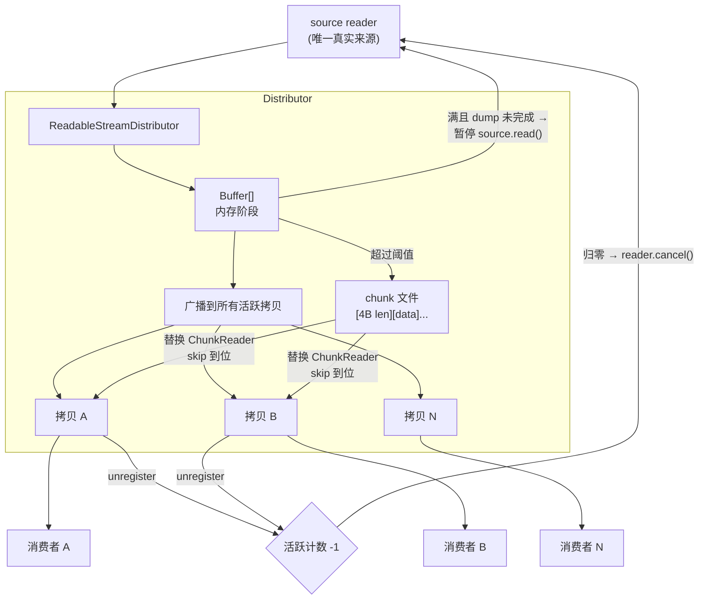
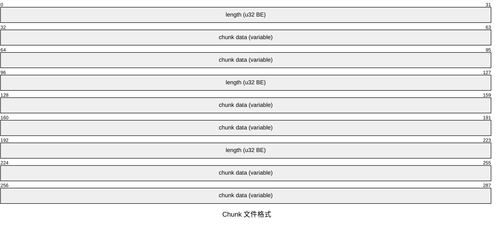
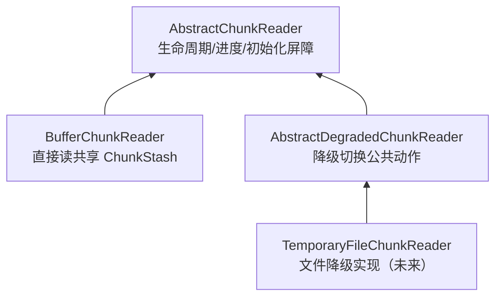
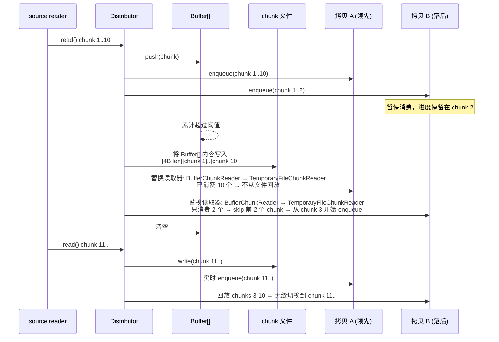
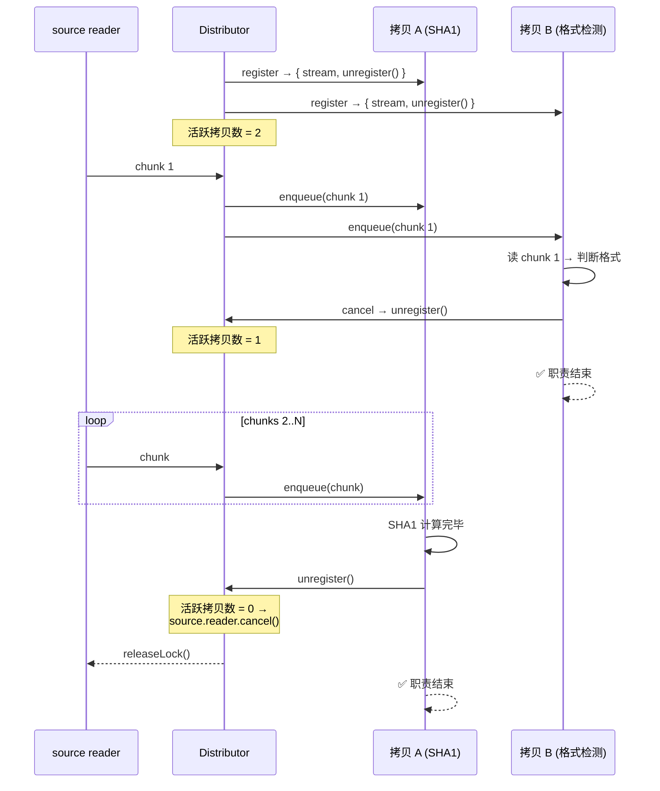

# ReadableStreamDistributor 设计文档

## 目标

`ReadableStream` 是单消费者模型——chunk 被一个消费者读走就从流中消失。
分发器打破这个限制：将一个源流分发给多个消费者，每个获得完整、独立
拷贝。消费进度互不干扰——快的不用等慢的，慢的不会丢数据。source
推进速率由全体消费者中最快的那一个自然驱动，慢者从磁盘追。

当所有消费者停止消费时，源流自动释放。

支持内存缓存自动溢出到磁盘，chunk 边界保持一致。

## 核心语义

```text
主入口流（唯一真实来源）
  → register({ label }) → { stream, unregister() }
  → 每个拷贝流独立消费
  → 任一拷贝 cancel 不影响其他
  → 拷贝消费完毕（done）或 cancel 均自动清理引用
  → unregister() 仅用于主动提前终止
  → 当且仅当所有拷贝都离开
  → 主入口流 reader.cancel() / releaseLock()
```

## API

`ReadableStreamDistributor` 提供默认实现，下游按需覆盖。

- `get highWaterMark()` → `os.freemem()`
- `get tmpdir()` → `os.tmpdir()`（实时读环境变量 `TMPDIR`，
  运维可在线调整，无需重启进程）

构造条件：`source` 必须未被锁定（`source.locked === false`），
否则拒绝构造。

```js
import { ReadableStreamDistributor } from '@produck/readable-stream-distributor';

// 零覆盖：全部默认即可用
const distributor = new ReadableStreamDistributor(source);

// 或按需覆盖
class MyDistributor extends ReadableStreamDistributor {
  get highWaterMark() {
    return this.config.maxBufferSize ?? super.highWaterMark;
  }
  get tmpdir() {
    return this.config.tmpdir ?? super.tmpdir;
  }
}
const distributor = new MyDistributor(source);

// 注意：一旦溢出到磁盘后，highWaterMark 不再被查询（单向门）

const copy = distributor.register({ label: 'sha1-checker' });
// label：助记符，用于事件和统计中标识拷贝，不作唯一性约束
// → { stream: ReadableStream, unregister(): void }

// 正常消费
const reader = copy.stream.getReader();
while (true) {
  const { value, done } = await reader.read();
  if (done) break;
}

// 提前终止——不影响其他拷贝（正常消费完毕无需手动调用）
copy.unregister();

// 消费者 cancel 自己的 stream 也会自动清理引用
reader.cancel();

// 强制销毁（框架层策略执行：body 超限、请求超时、客户端断开等）
// 与错误传播同模式——延迟暴露，不对拷贝搞突袭：
// 分发器标记为已销毁 → 不再从 source 拉取新 chunk
// → 各拷贝照常消费已缓冲数据 → 耗尽后 stream error
// → error 为可辨识类型（如 AbortError），下游可据此区分
//    意外终止（source error）与策略截断（destroy）
// → 关闭文件 → 释放 source reader → 分发器不可再用
distributor.destroy();
```

## 架构



### 模块

| 模块                          | 职责                                                                  |
| ----------------------------- | --------------------------------------------------------------------- |
| `ReadableStreamDistributor`   | 抽象类——多拷贝分发，引用计数，策略切换。`highWaterMark` 由下游实现    |
| `ChunkStash`                  | 共享内存缓冲容器——聚合 chunk，`drop()` 一次性清空并密封               |
| `BufferChunkReader`           | 内存阶段——直接消费共享 `ChunkStash`，按 index 读取                    |
| `AbstractDegradedChunkReader` | 降级读取器抽象中间层——静态转存（`_S.DUMP` + `S.DUMPING`），不绑定存储 |
| `TemporaryFileChunkReader`    | （未来）文件阶段——降级抽象层的 Node 文件系统实现                      |
| chunk 文件格式                | `[4B len][chunk data]...` 自描述序列                                  |

### 目录安排约定

- **内部类在对应的目录向下扩展**：非继承关系的内部实现类，在所属
  模块目录下各自建目录（向下嵌套扩展）。如 `ChunkStash/`、
  `ForkedReadableStream/` 在 `Distributor/` 下。
- **子类平行于其抽象类的类目录建立目录**：抽象类占据一个"类目录"
  （如 `ChunkReader/` = `AbstractChunkReader`）；继承它的子类，其目录
  与抽象类的类目录**平行**——同一父目录下的兄弟层级，而非在其内部
  向下扩展。子类目录内部按模块模式组织（`Abstract.mjs` / `Concrete.mjs`
  - `index.mjs` + `Symbol.mjs`）。
- **唯一特例：极端简化单文件**。无子类、无专属符号、无需独立导出
  入口的实现，可用单文件模式不建目录，平铺在与抽象类类目录平行的
  位置，文件名即类名。当前仅 `BufferChunkReader` 采用
  （`Distributor/BufferChunkReader.mjs`）。

示例：

```text
Distributor/
  BufferChunkReader.mjs # AbstractChunkReader 子类（单文件特例）
  ChunkReader/          # AbstractChunkReader（抽象类类目录）
    Abstract.mjs
    index.mjs
    Symbol.mjs
  DegradedChunkReader/  # AbstractDegradedChunkReader（子类，与 ChunkReader/ 平行）
    Abstract.mjs        # 抽象中间层
    index.mjs
    Symbol.mjs
  TemporaryFile/        # （未来）TemporaryFileChunkReader（子类，与 DegradedChunkReader/ 平行）
    Concrete.mjs
    index.mjs
    Symbol.mjs
  ChunkStash/           # 内部类（向下扩展）
  ForkedReadableStream/ # 内部类（向下扩展）
```

## 缓存文件格式

自描述 chunk 序列。内存→文件切换后，消费者看到的 chunk
边界与实时消费时完全一致。



- 写入：每 chunk `[4B BE uint32 length][body]`
- 回放：读 4B → 读 N 字节 → `enqueue` → 循环
- 回放时用 `fileHandle.read(buffer, offset, length, position)` 逐块游标前进

## 内存存储格式

内存阶段用 `Buffer[]` 数组，不与文件共用 `[4B len][chunk]` 格式。

`Buffer` 自带 `.length`，数组元素天然分隔 chunk。回放行为
与文件路径对称——两种存储格式对外吐出的 chunk 序列完全一致。

不可用单一大 `Buffer.alloc()` ——实际写入大小大概率不匹配，
小 body 时浪费巨大，大 body 时仍需溢出。

切换文件时，先将 `Buffer[]` 内容按文件格式写入，清空数组，
后续 chunk 直接走文件。

内存→磁盘是单向门：一旦切换，`highWaterMark` 后续变化不再
生效——木已成舟，不再回头。

## Chunk 读取器

**术语**：`ChunkReader` —— 一片一片读取 chunk 的概念装置。每个拷贝
持有独立的 `ChunkReader`，策略切换时替换读取器，提前 skip 到位。

与 `source reader`（从源流拉取的 reader）区分：`ChunkReader` 是拷贝
侧的读取装置，`source reader` 是分发器侧的拉取装置，二者职责不同，
代码与文档中不共用 `READER` 一词。

### 接口

```js
interface ChunkReader {
  read(): Promise<{ value: Uint8Array, done: boolean }>;
}
```

### 分叉架构

`ChunkReader` 家族在消费 `ChunkStash` 的方式上分叉：



- `BufferChunkReader` 直接消费共享 `ChunkStash`（按 index 读，`done`
  由 `stash.length` 决定），是内存路径分支。
- `AbstractDegradedChunkReader` 是降级读取器家族的抽象中间层。转存
  职责在**静态侧**：
  - `_S.DUMP(chunkStash)` — 抽象静态，返回 PromiseOr（会被转为
    Promise），转存 ChunkStash 到降级存储并执行 `stash.drop()`。
  - `dump(chunkStash)` — 公开静态，调用 `_S.DUMP`，Promisify 并做
    抽象层异常处理修饰，将生成的 Promise 记录到 `S.DUMPING`（静态
    WeakMap：`ChunkStash` ↔ 转存 Promise）。
  - `getChunkStashDumping()` — 实例级成员，从 `S.DUMPING` 查询本实例
    `ChunkStash` 的转存 Promise；初始化过程 `await` 它（仅阻塞，
    不提供产物）。
  - 转存产物经降级策略自备的 WeakMap 传递；`id` / 文件名等是降级
    策略内部细节，非分发器职责。
  - **不设 `_I.OPEN`**：抽象初始化 `_I.INITIALIZE` 已包含 open 概念。
- `TemporaryFileChunkReader` 是 `AbstractDegradedChunkReader` 的 Node
  文件系统实现；浏览器分支（IndexedDB / OPFS）同挂其下。

### 切换流程



## 读写协调

分发器不感知"落盘"——写入降级存储是**降级策略**的实现细节（呼应
BROWSER.md：分发器不 embody 文件系统概念）。分发器不维护
`committedChunks` 之类的落盘水位。

各层自我管理边界：

- **内存阶段**：`ChunkStash`（`BUFFER_STASH`）管理自身 chunk 边界
  （`length` / `byteLength`）。
- **降级阶段**：降级存储管理自身已写记录边界；降级 reader 读到自己
  存储的末尾即 `done`，无需分发器提供读水位。

写读并发（降级策略内部，如文件）无需文件锁：JS 单线程 + `await`
保证顺序，写入被内核接受后读才可见；不同 fd 读同一偏移量看到写
完成后的数据。

## 引用计数生命周期



| 事件                      | 活跃拷贝数                     |
| ------------------------- | ------------------------------ |
| 分发器启动，注册拷贝 A、B | 2                              |
| B cancel → unregister     | **1**                          |
| A 消费完毕 → unregister   | **0 → source.reader.cancel()** |

任一拷贝 cancel 不影响其他。最后一个拷贝离开时源头
才被释放。这就是"全停则全停"。

## 背压

分发器不主动拉取 source。source 的推进由拷贝的消费驱动——
拷贝的 `pull()` 触发 `source.read()`，拿到 chunk 后广播给所有
活跃拷贝（各自 `enqueue`）。

慢拷贝不阻塞快拷贝——落后时走 TemporaryFileChunkReader 从磁盘回放即
可，不参与 source 推进节奏。source 的速率由整体消费节奏决定，不由分发器
预设。

背压点只有一个：`Buffer[]` 已满且上一次 dump 尚未完成时，
暂停 `source.read()`，dump 完成后恢复。即**磁盘写入带宽决定速率**。

这与传统"木桶效应"（最慢消费者决定整体速率）不同——两级存储
（内存→磁盘）切断了快慢消费者之间的耦合。快拷贝驱动 source
推进，慢拷贝从文件追赶。磁盘是它们的缓冲带，而非瓶颈。

客观上，最快拷贝的消费节奏决定了 source 推进速率。当下游选择
快速消费时，自然获得附带收益：

- **缩短连接生命周期**：TCP 连接更快进入 CLOSE 或复用状态，减少
  代理超时、客户端超时、负载均衡器断开的风险窗口
- **数据先行落盘**：数据从脆弱的网络通道尽快转移到稳定存储，
  即使后续处理出错，仍在，可重试、可审计、可恢复
- **减少攻击面**：拖着不读的连接是敞开的资源消耗点

但分发器不替下游做这个决定——它是消费节奏的自然结果，不是
分发器的预设策略。

## 依赖

零外部依赖。仅使用：

- `node:fs`（`fs.open`、`fileHandle.read`、`fileHandle.write`）
- `node:stream/web`（`ReadableStream`）
- `node:os`（`freemem`、`tmpdir`）
- `node:path`（`join`）
- `node:crypto`（`randomBytes`——临时文件名）

## 待定

### 流终止信号

source 的终止信号（done / error / destroy）对每个拷贝**延迟暴露**——
各拷贝先正常消费自己进度之后的已缓冲 chunk，耗尽后才收到对应信号。

- **source done**：`controller.close()`，消费者的 `read()` 返回
  `{ done: true }`——正常结束
- **source error**：`controller.error(err)`，消费者的 `read()` reject
  ——意外终止
- **destroy**：同 error 路径，但错误类型可辨识（如 `AbortError`），
  下游可据此区分意外终止与策略截断

这保证每个拷贝拿到的始终是连续完整前缀（不会跳号、不会缺中间块），
且"来晚了"的拷贝也能利用已缓冲数据完成部分工作。新 `register()`
亦然。

对拷贝流而言，三种终止都是"流结束了"——下游不关心原因时统一处理，
需要区分时检查 `error.name`。

### 临时文件清理

临时文件清理策略继续搁置，实现时再定。

## 已知风险与可观测性

以下风险源于"数据与 exchange 生命周期解耦"的架构取舍，模块不替
调用方做强制策略，但提供可观测性信号：

- **悬空拷贝**：后处理拷贝出错或 hang 住时，HTTP 响应已发，无 channel
  回报状态
- **磁盘空间累积**：并发请求 × 慢拷贝消费时长 × 数据量 = 峰值磁盘
  占用
- **未 unregister 导致泄漏**：消费者既没 cancel 也没调 unregister
  且持有引用不释放时，文件描述符无法回收、磁盘文件无法删除

模块通过事件机制提供感知能力：当拷贝存活时间或落后程度超过阈值
时触发 `warn` 事件。默认策略为 `console.warn`，调用方可替换为
自定义处理器（接入日志系统、监控报警等）。这是提示而非强
制——若下游确实需要长时间后处理，忽略该事件即可。

### 纯内存模式

下游在 `get highWaterMark()` 中返回 `Number.MAX_SAFE_INTEGER`
即可事实上禁用磁盘溢出。

## 可观测性

### 生命周期事件

分发过程各节点均暴露事件，下游可零侵入接入日志与监控：

| 事件                | 含义                                   |
| ------------------- | -------------------------------------- |
| `copy:registered`   | 新拷贝上线，携带 `label`               |
| `copy:done`         | 拷贝正常消费完毕，自动清理             |
| `copy:cancelled`    | 拷贝被 cancel                          |
| `copy:unregistered` | 显式调用 unregister                    |
| `source:done`       | 源流正常结束                           |
| `source:error`      | 源流出错                               |
| `all:empty`         | 所有拷贝离开，分发器释放               |
| `destroy`           | 强制销毁，拷贝耗尽已缓冲数据后 → error |

### 统计

只读 `stats` 对象，实现成本极低：

```js
distributor.stats  // →
{
  bytesBuffered,   // 当前 Buffer[] 字节数
  bytesWritten,    // 已写入磁盘总字节数
  totalChunks,     // 已处理 chunk 数
  activeCopies,    // 当前活跃拷贝数
  peakCopies,      // 历史峰值拷贝数
}
```

## 非目标

以下不在本模块的职责范围内——这些是上层调用方的职责：

- 数据大小限制和错误码语义
- HTTP method 白名单
- "已消费"标志位管理
- 框架层响应生命周期协调
- 任何协议相关逻辑
